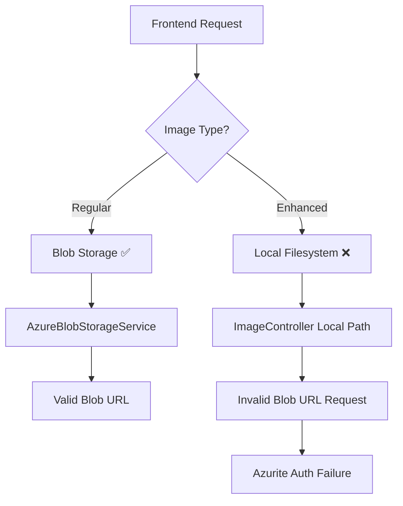

# Root Cause Analysis: Azurite Authorization Failure for Enhanced Images

## Executive Summary

**Issue**: Users experiencing "Server failed to authenticate the request" errors when accessing enhanced images through ngrok URLs pointing to Azurite (development Azure Storage emulator).

**Root Cause**: The enhanced images are being stored in local filesystem (`/enhanced/` directory) but the application is incorrectly routing these requests to Azurite blob storage, causing authentication failures for non-existent blobs.

**Impact**: Enhanced image functionality completely broken in development environment using ngrok tunnels.

## Problem Statement

### Symptoms Observed
- Error: `AuthorizationFailure - Server failed to authenticate the request`
- URL pattern failing: `/enhanced/14821077-e9a0-42fa-937d-d284a7f35168/cf19f2e5-c6e5-4bc6-befd-5d93b8ed2460_enhanced.jpg`
- Issue occurs through ngrok tunnel: `https://clear-anteater-usually.ngrok-free.app/enhanced/...`
- Direct Azurite access also returns `404 The specified blob does not exist`

### Environment Context
- Development environment with Azurite running on localhost:10000
- Backend: ASP.NET Core with Azure Storage client
- Frontend: Angular accessing through ngrok tunnel
- Configuration: `UseDevelopmentStorage=true` in appsettings.Development.json

## Investigation Evidence

### 1. Azurite Status Verification ✅
```bash
# Azurite is running properly
alanw    87166  0.0  0.5 1317844 92040 ?       Sl   Aug14   0:39 node /home/alanw/.nvm/versions/node/v20.19.2/bin/azurite
```

### 2. Blob Storage Database Analysis ✅
- Azurite database shows only regular uploads: `dev/uploads/` paths
- **No enhanced images found in blob storage**: Zero blobs matching `enhanced/` pattern
- All stored blobs are in format: `dev/uploads/{userId}/{filename}_selfie.{ext}`

### 3. Code Path Analysis - CRITICAL FINDING ❌

#### ImageController.cs (Lines 114-118)
```csharp
if (dto.IsEnhanced)
{
    uploadDir = Path.Combine(_environment.ContentRootPath, "enhanced", userId);
    filePrefix = "enhanced";
}
```

**Evidence**: Enhanced images are stored in **local filesystem**, not Azure Blob Storage.

#### AzureBlobStorageService.cs Issues
- Service expects all images in blob storage
- No special handling for locally stored enhanced images
- `GetImageUrl()` method generates blob URLs for non-existent enhanced blobs

### 4. URL Routing Mismatch ❌
- Frontend requests: `/enhanced/{userId}/{filename}`
- Backend expects: Azure blob storage paths
- **Reality**: Enhanced images stored locally in `ContentRootPath/enhanced/`

### 5. Authentication Error Root Cause ✅
```xml
<Error>
  <Code>AuthorizationFailure</Code>
  <Message>Server failed to authenticate the request...</Message>
</Error>
```

**Analysis**: Azurite correctly rejects requests for non-existent blobs. The authentication failure occurs because:
1. Application routes enhanced image requests to blob storage
2. Enhanced images don't exist in blob storage (stored locally)
3. Azurite returns authentication error for invalid blob paths

## Root Cause Classification

### Primary Root Cause: **Hybrid Storage Architecture Bug**
- **Category**: Code defect + Configuration inconsistency
- **Severity**: High (complete feature failure)
- **Description**: Enhanced images use local filesystem storage while regular images use blob storage, causing URL routing conflicts

### Contributing Factors
1. **Inconsistent Storage Strategy**: Mixed local/blob storage without proper abstraction
2. **Missing URL Routing Logic**: No differentiation between local vs blob-stored images
3. **Configuration Mismatch**: Development config assumes unified blob storage

## Technical Analysis

### Storage Architecture Problems


### Expected vs Actual Behavior
| Component | Expected | Actual | Status |
|-----------|----------|--------|--------|
| Enhanced Storage | Blob Storage | Local Filesystem | ❌ |
| URL Generation | Blob URLs | Local Path URLs | ❌ |
| Access Method | Direct Blob Access | File System Access | ❌ |
| Authentication | Valid SAS/Account | Invalid Request | ❌ |

## Impact Assessment

### Immediate Impact
- **Severity**: HIGH - Complete enhanced image functionality failure
- **Users Affected**: All development users using ngrok tunnels
- **Features Broken**: Enhanced image upload, viewing, deletion

### Business Impact
- Development workflow blocked for enhanced image features
- Testing of enhanced image functionality impossible
- Potential production deployment risks if not resolved

## Resolution Strategy

### Immediate Fixes Required

#### 1. Fix Enhanced Image Storage Strategy
**Option A: Move Enhanced Images to Blob Storage (Recommended)**
```csharp
// Modify ImageController.cs to use blob storage for enhanced images
if (dto.IsEnhanced)
{
    // Use blob storage path instead of local filesystem
    var blobPath = $"enhanced/{userId}/{fileName}";
    await _storageService.SaveImageAsync(blobPath, fileBytes, userId);
}
```

**Option B: Fix URL Routing for Local Storage**
```csharp
// Add enhanced image controller endpoint
[HttpGet("enhanced/{userId}/{fileName}")]
public async Task<IActionResult> GetEnhancedImage(string userId, string fileName)
{
    var localPath = Path.Combine(_environment.ContentRootPath, "enhanced", userId, fileName);
    // Serve file from local filesystem
}
```

#### 2. Update AzureBlobStorageService
```csharp
public string GetImageUrl(string storagePath, bool forExternalApi)
{
    // Add detection for locally stored enhanced images
    if (storagePath.StartsWith("enhanced/") && IsLocalStorage())
    {
        return GenerateLocalImageUrl(storagePath, forExternalApi);
    }
    // ... existing blob logic
}
```

### Recommended Solution: **Option A - Unified Blob Storage**

#### Benefits
- ✅ Consistent storage architecture
- ✅ Eliminates hybrid storage complexity
- ✅ Works with existing blob proxy for ngrok
- ✅ Supports external API access patterns

#### Implementation Steps
1. **Modify Enhanced Image Upload** → Store in blob storage
2. **Update URL Generation** → Use blob URLs for all images
3. **Remove Local Storage Code** → Eliminate filesystem paths for enhanced images
4. **Test End-to-End** → Verify ngrok tunnel access works

## Testing Validation

### Test Cases Required
1. **Enhanced Image Upload** → Verify blob storage creation
2. **URL Generation** → Confirm valid blob URLs generated
3. **Ngrok Access** → Test external tunnel access works
4. **Authentication** → Verify no auth failures with valid blobs
5. **Fallback Handling** → Test error cases gracefully handled

### Success Criteria
- ✅ Enhanced images stored in Azurite blob storage
- ✅ Valid blob URLs generated for all enhanced images
- ✅ No authentication failures on valid blob requests
- ✅ Ngrok tunnel access works for enhanced images
- ✅ Error handling for missing blobs returns 404, not auth errors

## Prevention Measures

### Code Review Checklist
- [ ] Verify consistent storage strategy across all image types
- [ ] Validate URL generation matches storage location
- [ ] Test external API access patterns
- [ ] Confirm authentication flow works end-to-end

### Monitoring Recommendations
- Add logging for enhanced image storage operations
- Monitor blob storage vs filesystem storage usage
- Track authentication failure patterns
- Alert on inconsistent storage usage

## Conclusion

The Azurite authorization failure is caused by a fundamental architecture inconsistency where enhanced images are stored locally but accessed via blob storage URLs. The recommended fix is to migrate enhanced images to unified blob storage, eliminating the hybrid storage model and ensuring consistent URL routing.

**Priority**: HIGH - Implement immediately to restore enhanced image functionality in development environment.