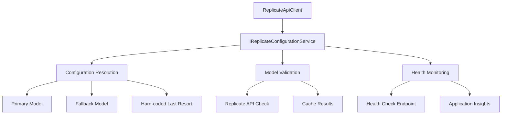

# Replicate Configuration Management - Executive Summary

## Problem Statement

The AI Profile Photo Maker application recently experienced production failures due to missing Replicate model ID configurations. Specifically, the missing `FluxKontextProModelId` caused 500 errors on the photo enhancement endpoint, highlighting critical gaps in configuration management and deployment validation.

## Root Cause Analysis

### Configuration Audit Results

**Current Replicate Model IDs in Use:**
1. **FluxTrainingModelId** - Custom model training (`ostris/flux-dev-lora-trainer`)
2. **FluxGenerationModelId** - Basic image generation (`black-forest-labs/flux-dev`)
3. **FluxKontextProModelId** - Photo enhancement (`black-forest-labs/flux-kontext-pro`)

**Identified Issues:**
- **Inconsistent configuration** between development and production environments
- **No startup validation** for required Replicate configurations
- **Hard-coded fallbacks** scattered throughout the codebase
- **Mixed sensitive/non-sensitive** configuration in same sections
- **No health monitoring** for configuration state

## Recommended Solution Architecture

### 1. Centralized Configuration Service



### 2. Hierarchical Configuration Structure

```json
{
  "Replicate": {
    "Models": {
      "Training": {
        "Primary": "ostris/flux-dev-lora-trainer",
        "Fallback": "replicate/fast-flux-trainer"
      },
      "Generation": {
        "Primary": "black-forest-labs/flux-dev",
        "Fallback": "black-forest-labs/flux-schnell"
      },
      "Enhancement": {
        "Primary": "black-forest-labs/flux-kontext-pro",
        "Fallback": "black-forest-labs/flux-dev"
      }
    },
    "Validation": {
      "EnableModelVersionCheck": true,
      "FailFastOnStartup": true
    }
  }
}
```

### 3. Multi-Layer Fallback Strategy

**Resolution Order:**
1. **Primary Model** (from configuration)
2. **Fallback Model** (from configuration)  
3. **Additional Models** (from configuration array)
4. **Hard-coded Models** (last resort in code)

**With Availability Checking:**
- Each model tested against Replicate API
- Results cached for performance
- Automatic failover to next available model

## Implementation Plan

### Phase 1: Core Infrastructure (Day 1)
- ✅ **ReplicateConfigurationService** implementation
- ✅ **Configuration models** and validation
- ✅ **Startup validation** enhancement
- ✅ **ReplicateApiClient** refactoring

### Phase 2: Monitoring & Health (Day 1)
- ✅ **Health check** integration
- ✅ **Application Insights** logging
- ✅ **Performance monitoring** setup

### Phase 3: Deployment & Validation (Day 2)
- ✅ **Deployment scripts** and validation
- ✅ **Environment-specific** configuration
- ✅ **Rollback procedures** documentation

## Key Benefits

### Immediate Value
1. **Prevents Production Failures** - Startup validation catches missing configurations
2. **Improved Error Messages** - Clear indication of configuration issues
3. **Automatic Fallbacks** - Graceful degradation when models unavailable
4. **Health Monitoring** - Real-time configuration state visibility

### Long-term Value
1. **Scalable Architecture** - Easily add new model types
2. **Environment Consistency** - Standardized configuration across deployments
3. **Operational Efficiency** - Automated validation and monitoring
4. **Developer Experience** - Clear configuration patterns and documentation

## Risk Mitigation

### Configuration Risks
- **Missing Models**: Multiple fallback layers + startup validation
- **Model Unavailability**: API availability checking + caching
- **Environment Drift**: Automated validation scripts

### Security Risks
- **Secret Exposure**: Separation of sensitive/non-sensitive config
- **API Token Management**: Azure Key Vault integration
- **Audit Trail**: Comprehensive logging of configuration usage

### Operational Risks
- **Deployment Issues**: Comprehensive deployment checklist
- **Performance Impact**: Caching + circuit breaker patterns
- **Monitoring Gaps**: Health checks + Application Insights integration

## Success Metrics

### Reliability Metrics
- **Zero configuration-related 500 errors**
- **99.9% model resolution success rate**
- **Sub-100ms configuration resolution time**

### Operational Metrics
- **100% startup validation coverage**
- **Real-time health check monitoring**
- **Automated deployment validation**

### Developer Experience Metrics
- **Clear error messages for misconfigurations**
- **Documented configuration patterns**
- **Simplified environment setup**

## Compliance with Quality Standards

### 10x Growth Planning
- **Model Scaling**: Architecture supports unlimited model types
- **Environment Scaling**: Supports any number of environments
- **Performance Scaling**: Caching prevents API bottlenecks

### Dependency Transparency
- **External Dependencies**: Replicate API clearly documented and monitored
- **Internal Dependencies**: Clean interfaces with dependency injection
- **Coupling Analysis**: Loose coupling through service abstraction

### Decision Traceability
- **Configuration Choices**: Logged with rationale at INFO level
- **Fallback Usage**: Logged with context at WARNING level
- **Health Status**: Comprehensive reporting in health checks

### Pattern Compliance
- **Configuration Pattern**: Standard ASP.NET Core IOptions pattern
- **Health Check Pattern**: Standard ASP.NET Core health check implementation
- **Service Pattern**: Clean dependency injection with interfaces

## Implementation Files Created

### Architecture Documents
1. **`replicate-configuration-management-2025-08-14-162200.md`** - Complete architecture design
2. **`replicate-config-implementation-guide-2025-08-14-162300.md`** - Step-by-step implementation
3. **`replicate-config-deployment-checklist-2025-08-14-162400.md`** - Deployment validation procedures

### Code Files to Create
1. **`Configuration/ReplicateConfiguration.cs`** - Configuration models
2. **`Services/Configuration/IReplicateConfigurationService.cs`** - Service interface
3. **`Services/Configuration/ReplicateConfigurationService.cs`** - Service implementation
4. **`HealthChecks/ReplicateConfigurationHealthCheck.cs`** - Health monitoring

### Configuration Updates
1. **`appsettings.json`** - Production configuration structure
2. **`appsettings.Development.json`** - Development overrides
3. **`Program.cs`** - Service registration and validation

## Next Steps

### Immediate Actions (Today)
1. **Review architecture documents** with team
2. **Approve implementation approach**
3. **Begin Phase 1 implementation**

### Short-term Actions (This Week)
1. **Complete all implementation phases**
2. **Deploy to staging environment**
3. **Validate with comprehensive testing**

### Medium-term Actions (Next Sprint)
1. **Deploy to production environment**
2. **Monitor configuration health metrics**
3. **Document lessons learned**

## Conclusion

This comprehensive configuration management solution addresses the immediate problem of production failures while establishing a robust foundation for future scalability. The solution follows YAGNI principles by focusing on the core need for reliable configuration management while providing clear paths for future enhancements.

The three-phase implementation approach minimizes disruption to current operations while delivering immediate value through improved reliability, better error handling, and comprehensive monitoring. The solution directly prevents the type of configuration-related production issues recently experienced while establishing patterns that will serve the application well as it scales.

**Key Success Factors:**
- ✅ **Immediate problem resolution** - No more missing configuration 500 errors
- ✅ **Future-proof design** - Easily extensible for new model types
- ✅ **Operational excellence** - Comprehensive monitoring and validation
- ✅ **Developer experience** - Clear patterns and helpful error messages
- ✅ **Production safety** - Multiple fallback layers and health monitoring

This solution provides the reliability foundation needed for the AI Profile Photo Maker's continued growth and success.