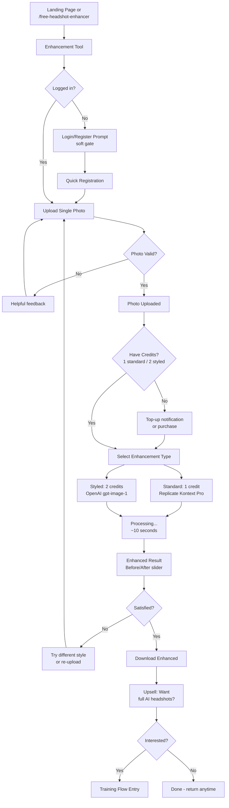
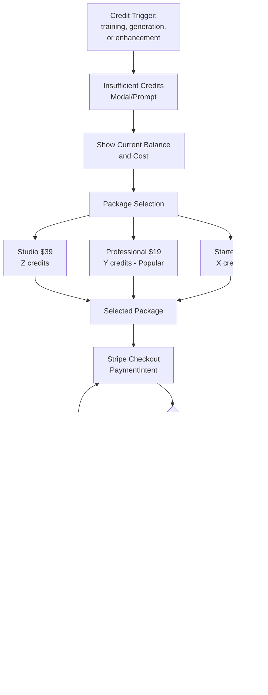
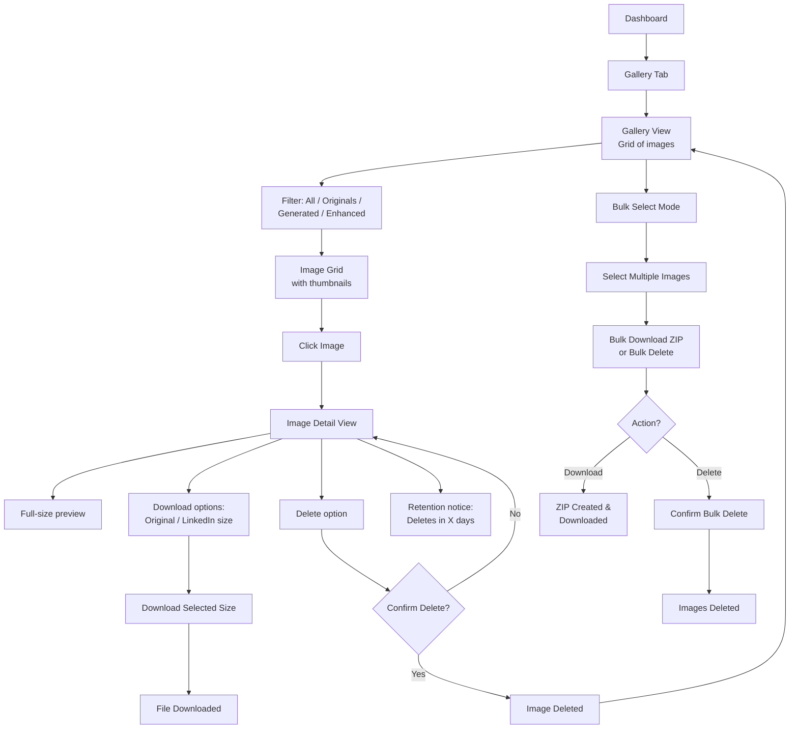

# UX Design Specification: AI.ProfilePhotoMaker

**Author:** Alan
**Date:** Fri Jan 23 2026

---

## Executive Summary

### Project Vision

AI.ProfilePhotoMaker transforms casual selfies into professional, studio-quality headshots using AI-powered model training and style generation. The platform eliminates the need for expensive photographers and inconvenient studio sessions, delivering professional profile photos in minutes for a fraction of traditional costs ($9-$39 vs $150-500+).

The core value proposition: **"Professional Headshots in Minutes - Not Hours at a Studio"**

### Target Users

| Segment | Description | Primary Motivation | Tech Comfort |
|---------|-------------|-------------------|--------------|
| **Job Seekers** | Professionals actively searching for new roles | Need credible LinkedIn photo fast | Medium-High |
| **Remote Professionals** | Work-from-home professionals without access to local photographers | Convenience and cost savings | High |
| **Entrepreneurs/Freelancers** | Self-employed professionals building personal brand | Budget-conscious branding | Medium-High |
| **Career Changers** | Professionals pivoting to new industries | Fresh start, new professional image | Medium |

**User Pain Points:**
- Professional photographers are expensive ($150-500+)
- Scheduling appointments is inconvenient
- Awkward/uncomfortable photo sessions
- Need photos quickly (job interview coming)
- Uncertain about AI quality ("Will it look fake?")

**Decision Factors (in priority order):**
1. Quality of sample results (before/after proof)
2. Reviews/testimonials (trust signals)
3. Money-back guarantee (risk reduction)
4. Price
5. Speed of delivery

### Key Design Challenges

1. **Trust & Conversion Gap**: Traffic exists but doesn't convert. Users need immediate visual proof of value and credible social proof to overcome skepticism about AI-generated images.

2. **Multi-Step Journey with Wait States**: The upload → train → generate flow involves multiple stages with processing time. Users need clear progress indicators, time expectations, and confidence they're on track.

3. **Credit System Abstraction**: The internal credit system is confusing to users. UX must translate credits into user-friendly outcomes (headshot counts, not credit numbers).

4. **First-Time User Trust**: Users are uploading personal photos to a new service. Privacy messaging, guarantees, and trust signals must be prominent throughout the journey.

5. **Mobile-First Consideration**: Many users will upload selfies directly from mobile devices. The upload and gallery experience must work seamlessly on mobile.

### Design Opportunities

1. **Visual-First Persuasion**: Leverage before/after transformations throughout the experience - hero, onboarding, style selection, and results - to continuously reinforce value.

2. **Guided Wizard Experience**: A clear step-by-step flow with progress indicators, time estimates, and encouraging micro-copy reduces anxiety and abandonment.

3. **Preview Before Payment**: Consider showing watermarked/low-res previews before purchase to reduce friction (competitive advantage vs some competitors).

4. **Delightful Wait States**: Transform waiting time into engagement with progress animations, fun facts, or style previews.

5. **LinkedIn-Specific Positioning**: Position explicitly for LinkedIn/professional use with research-backed messaging (profiles with photos get 21x more views).

## Core User Experience

### Defining Experience

The core experience of AI.ProfilePhotoMaker centers on a single transformative moment: **seeing yourself as a professional**. Users upload casual selfies and receive studio-quality headshots - the "wow" happens when they see their transformation.

**Primary User Action:** Generate professional headshots from uploaded photos
**Core Loop:** Upload → Train → Generate → Download → (Return to generate more styles)

The experience must make users feel they've discovered a "secret" - professional results at a fraction of the cost, without the hassle of traditional photography.

### Platform Strategy

| Platform | Priority | Rationale |
|----------|----------|-----------|
| **Web (Responsive)** | Primary | Broadest reach, no app store friction |
| **Mobile Web** | Critical | Selfie uploads happen on phones |
| **Desktop Web** | Important | Purchase decisions and detailed gallery review |

**Key Platform Decisions:**
- Mobile-first upload experience (camera integration, easy multi-select)
- Responsive gallery that works on all devices
- No native app required for MVP - web covers all use cases

### Effortless Interactions

| Interaction | Design Goal |
|-------------|-------------|
| **Photo Upload** | Drag-drop or tap, instant preview, no manual cropping required |
| **Style Browsing** | Visual catalog with before/after previews per style |
| **Generation** | One-click with clear progress, no complex options |
| **Download** | Single click, LinkedIn-optimized dimensions included |
| **Purchase** | Headshot counts (not credits), transparent pricing |

**Automatic Behaviors:**
- Smart photo validation (resolution, face detection) with helpful guidance
- Auto-optimization of uploaded images for training
- Background model training with progress notifications
- Intelligent style recommendations based on user context

### Critical Success Moments

| Moment | Success Criteria | Failure Risk |
|--------|------------------|--------------|
| **Landing Page** | User sees before/after proof and believes quality | Bounces without signup |
| **First Upload** | Feels safe, fast, and easy | Abandons due to friction or trust concerns |
| **Training Wait** | Confident it's working, time feels acceptable | Thinks it's broken, leaves |
| **First Result Reveal** | "Wow, that's really me - but better!" | Disappointed, requests refund |
| **Download & Use** | Works perfectly on LinkedIn, gets compliments | Image quality issues, wrong dimensions |

### Experience Principles

1. **Show, Don't Tell**
   Before/after transformations visible everywhere. Real samples (founder's own photos) build authenticity. Visual proof precedes any text explanation.

2. **Price as Superpower**
   Lead with value advantage. "$9 vs $150+ studio sessions" messaging prominent. No hidden costs, no confusing credit systems.

3. **Confidence Through Clarity**
   Time estimates on every wait state. Progress indicators that move. Clear next steps at every stage. No black boxes.

4. **Authentic Over Perfect**
   Real founder samples over stock imagery. Honest "we're new but quality-focused" positioning. Transparency builds trust that polished marketing can't.

5. **One-Click Philosophy**
   Every action should feel like a single click. Upload = select and done. Generate = pick style and go. Download = click and ready for LinkedIn.

## Desired Emotional Response

### Primary Emotional Goals

**Core Emotional Outcome:** "I look amazing" - Confident Professional Pride

Users should walk away feeling genuinely proud of how they present themselves professionally. This isn't about vanity - it's about credibility, confidence, and feeling like they belong in professional spaces.

**Supporting Emotions:**
- **Delighted Surprise** - Quality exceeds expectations for the price
- **Smart Satisfaction** - Found an efficient solution others don't know about
- **Trust** - Feels safe uploading personal photos

**Emotional Hierarchy:**
1. Confidence/Pride (primary - the transformation outcome)
2. Delight (secondary - the quality surprise)
3. Trust (foundation - enables the journey)

### Emotional Journey Mapping

| Stage | Starting Emotion | Target Emotion | Transition Trigger |
|-------|------------------|----------------|-------------------|
| **Discovery** | Skeptical | Intrigued | Before/after proof |
| **Signup** | Hesitant | Reassured | Privacy messaging, guarantee |
| **Upload** | Anxious | Confident | Easy flow, validation feedback |
| **Training Wait** | Impatient | Anticipation | Progress animation, time estimate |
| **Results Reveal** | Uncertain | **Delighted** | Dramatic reveal, quality surprise |
| **Style Selection** | Curious | Excited | Multiple great options |
| **Download** | Hopeful | **Proud** | High-res result, LinkedIn-ready |
| **Post-Use** | Vulnerable | **Confident** | Compliments, profile views |

### Micro-Emotions

**Trust-Building Micro-Emotions:**
- "My photos are safe" → Privacy badges, deletion controls visible
- "This is legitimate" → Real founder samples, honest messaging
- "I can get my money back" → Guarantee prominently displayed

**Delight Micro-Emotions:**
- "That's all it costs?" → Price comparison with traditional photography
- "This is actually easy" → Smooth upload, no confusing steps
- "It's working!" → Animated progress during training

**Pride Micro-Emotions:**
- "That's really me" → Results that look authentic, not fake
- "I look professional" → Studio-quality output
- "I made a smart choice" → Value realization

### Design Implications

| Emotional Goal | UX Design Approach |
|----------------|-------------------|
| **Confidence/Pride** | High-quality result previews, professional styling, LinkedIn optimization messaging |
| **Delight** | Reveal animations, before/after comparisons at results, celebration micro-interactions |
| **Trust** | Privacy-first messaging, visible guarantees, real founder samples, transparent process |
| **Anticipation** | Engaging wait states, progress that moves, "almost there" messaging |
| **Accomplishment** | Clear completion states, download confirmation, "ready for LinkedIn" messaging |

**Interactions to Add Delight:**
- Subtle animation when results first appear (fade-in reveal, not jarring)
- Confetti or subtle celebration on first download
- "Your new professional look" framing on results page

**Interactions to Prevent Negative Emotions:**
- Never leave user without feedback during waits
- Always show clear next step
- Validate uploads immediately with helpful guidance (not errors)
- Money-back guarantee visible at decision points

### Emotional Design Principles

1. **Pride is the North Star**
   Every design decision should ask: "Does this help the user feel proud of their professional image?" The transformation from casual selfie to professional headshot should feel meaningful.

2. **Trust Before Transaction**
   Users upload personal photos before paying. Build trust through transparency (real samples, privacy messaging, guarantees) before asking for commitment.

3. **Delight Through Quality, Not Gimmicks**
   The "wow" comes from results that exceed expectations, not flashy animations. Let the transformation speak for itself.

4. **Anxiety is the Enemy**
   Proactively address every moment of potential uncertainty. Time estimates, progress indicators, and clear next steps prevent the anxiety that causes abandonment.

5. **Celebrate the Outcome**
   The download isn't the end - it's the beginning of the user's new professional presence. Frame the completion as an achievement worth celebrating.

## UX Pattern Analysis & Inspiration

### Inspiring Products Analysis

**Canva** - Design democratization done right
- **Core Strength:** Makes professional design accessible to non-designers
- **Key UX Wins:** Template-first approach, instant preview, one-click export for specific platforms
- **Emotional Hook:** Users feel capable and creative, not intimidated
- **Applicable Lesson:** Start users with polished options (styles), not blank slates. Make export dead simple with platform-specific options ("Download for LinkedIn").

**CapCut** - AI magic made tangible
- **Core Strength:** One-tap transformations that feel like magic
- **Key UX Wins:** Before/after comparisons, mobile-first design, trend-driven templates
- **Emotional Hook:** Users feel like they have superpowers
- **Applicable Lesson:** The AI transformation should feel magical. Before/after slider for results reveal. Mobile experience must be excellent for selfie uploads.

**LinkedIn (Target Platform Context)**
- **User Mindset:** Professional, time-constrained, goal-oriented
- **Quality Bar:** Must look credible and polished, not "AI-generated"
- **Key Insight:** Users are comparing to $150-500 photographer alternatives
- **Applicable Lesson:** Frame everything around LinkedIn success. "Ready for LinkedIn" messaging. Professional credibility is the outcome users are buying.

### Transferable UX Patterns

**Navigation & Flow Patterns:**
| Pattern | Source | Application |
|---------|--------|-------------|
| Template/Style-first selection | Canva | Users pick desired "look" before uploading, setting expectations |
| Progressive disclosure | Canva | Simple default flow, advanced options available but not overwhelming |
| Mobile-first upload | CapCut | Thumb-friendly photo selection, camera integration |

**Interaction Patterns:**
| Pattern | Source | Application |
|---------|--------|-------------|
| Before/after slider | CapCut | Results reveal page - drag to compare transformation |
| One-tap magic | CapCut | "Generate" should feel like pressing a magic button |
| Instant preview | Canva | Show style previews before committing to generation |
| Platform-specific export | Canva | "Download for LinkedIn" with correct dimensions |

**Trust & Conversion Patterns:**
| Pattern | Source | Application |
|---------|--------|-------------|
| Freemium with visible value | Canva | Free enhancement tier demonstrates quality before purchase |
| Trending/popular indicators | CapCut | "Most popular style" badges guide uncertain users |
| Social proof numbers | Competitors | Display real usage stats (photos generated, users) |

### Anti-Patterns to Avoid

| Anti-Pattern | Why It Fails | Prevention Strategy |
|--------------|--------------|---------------------|
| **Fake testimonials** | Sophisticated users spot them instantly, destroys all trust | Use real founder samples, build authentic reviews over time |
| **Credit-based pricing language** | Users can't translate credits to outcomes | Always show headshot counts, not credit numbers |
| **No visual proof above fold** | Users bounce before understanding value | Before/after prominently in hero section |
| **Hidden or confusing pricing** | Creates suspicion, feels like a trap | Transparent pricing visible early, no surprises |
| **Silent processing states** | Users think the app is broken | Always show progress, time estimates, reassuring messages |
| **Overwhelming options** | Paralysis of choice, especially for new users | Curated defaults, "recommended" badges, progressive disclosure |
| **Generic stock imagery** | Feels impersonal and corporate | Real founder samples, authentic photography |

### Design Inspiration Strategy

**Patterns to Adopt Directly:**
- Before/after slider for results reveal (CapCut-style)
- "Download for LinkedIn" one-click export (Canva-style)
- Mobile-first upload experience (CapCut-style)
- Progress indicators with time estimates during waits

**Patterns to Adapt:**
- Template-first approach → Style preview gallery before upload commitment
- Trending indicators → "Most popular style" badges (adapt once you have data)
- Freemium value demonstration → Free enhancement as quality proof

**Patterns to Intentionally Avoid:**
- Complex editing interfaces (you're not Canva - keep it simple)
- Subscription-first pricing (one-time purchase is your advantage)
- AI-generated testimonials or fake social proof
- Credit systems visible to users (abstract to headshot counts)

**Unique Differentiators to Protect:**
- Price advantage ($9-39 vs $150+ alternatives)
- Authentic founder samples (real, not stock)
- Transparent, honest positioning ("we're new but quality-focused")
- LinkedIn-specific optimization and messaging

## Design System Foundation

### Design System Choice

**Approach:** Themeable Hybrid System (Tailwind CSS + Custom SASS)

The project already has a mature, well-architected design system that requires no fundamental changes. The existing system provides:

- **Tailwind CSS 3.4** for rapid utility-first development
- **Custom SASS architecture** for complex components and theming
- **CSS Custom Properties** for dynamic theming (light/dark modes)
- **Comprehensive animation library** for micro-interactions

### Rationale for Selection

| Factor | Assessment |
|--------|------------|
| **Speed** | Tailwind utilities enable rapid iteration |
| **Uniqueness** | Custom glassmorphism and animation systems create distinctive visual identity |
| **Maintainability** | Well-organized SASS partials with clear naming conventions |
| **Accessibility** | Built-in reduced-motion support, proper color contrast |
| **Mobile Support** | Responsive breakpoints and mobile-first utilities |

**Why no change is needed:**
1. System already supports all identified UX patterns (before/after, progress states, hover effects)
2. Theme support enables the dark, professional aesthetic that builds trust
3. Animation library covers all required micro-interactions
4. Glassmorphism effects align with modern, premium positioning

### Implementation Approach

**Existing Architecture (Preserve):**
```
src/
├── styles.sass                    # Global styles, theme variables
├── app/shared/styles/
│   ├── _redesign-system.sass     # Glassmorphism, bento grid, animations
│   ├── _mixins.sass              # Reusable style patterns
│   ├── _utilities.sass           # Helper classes
│   └── index.sass                # Style exports
├── app/dashboard/styles/
│   ├── _variables.sass           # Dashboard-specific tokens
│   └── [component partials]      # Component styles
└── tailwind.config.js            # Tailwind customization
```

**Key Design Tokens (Current):**
| Token | Light Theme | Dark Theme |
|-------|-------------|------------|
| `--primary` | `#4fd1c7` | `#4fd1c7` |
| `--bg-primary` | `#e9ecef` | `#1a1d23` |
| `--text-primary` | `#1a202c` | `#ffffff` |
| `--glass-bg` | `rgba(255,255,255,0.1)` | `rgba(30,41,59,0.3)` |

### Customization Strategy

**Enhancements to Consider (Not Required for MVP):**

1. **Before/After Component Tokens**
   - Already have `@mixin before-after-card` in redesign system
   - Consider adding slider-specific variables for comparison interactions

2. **Progress State Animations**
   - Existing `shimmer`, `pulse-glow` keyframes cover loading states
   - Add training-specific progress animation if needed

3. **Trust Badge Styles**
   - Add utility classes for guarantee badges, privacy indicators
   - Leverage existing `--accent-success` for trust-positive elements

4. **LinkedIn-Specific Export Styling**
   - Consider "Download for LinkedIn" button variant
   - Use existing primary button with LinkedIn-blue accent option

**No Breaking Changes Required:**
The current design system fully supports all UX requirements identified in this specification. Implementation should extend, not replace, existing patterns.

## Defining Experience

### The Core Interaction

Every successful product has a defining experience — the core interaction that, if nailed, makes everything else follow.

- **Tinder:** "Swipe to match with people"
- **Canva:** "Pick a template and it looks professional instantly"
- **CapCut:** "One tap and your video looks amazing"

**For AI.ProfilePhotoMaker, the defining experience is:**

> **"See yourself transformed into a professional"** — the moment a user sees their casual selfie rendered as a studio-quality headshot.

This is the "wow" moment. It's not the upload. It's not the training. It's not the download. It's **the reveal** — the instant users see *themselves*, but looking like they just walked out of a $500 photo studio. This is what they'll screenshot and share. This is what converts skeptics into buyers.

### User Mental Model

**How users currently solve this problem:**
They book a photographer ($150-500+), travel to a studio, sit through an awkward session, and wait days for edited photos. The mental model is: *"Professional photos require professional photographers."*

**What users bring to AI.ProfilePhotoMaker:**
- **Skepticism:** "AI photos look fake"
- **Hope:** "Maybe this actually works?"
- **Comparison benchmark:** They're measuring against studio photography quality
- **Urgency:** Often triggered by a job interview or LinkedIn refresh

**Where confusion lives:**
- The multi-step flow (upload → train → generate) is unfamiliar — no photographer requires "training"
- Wait states feel uncertain — "Is it working? Did it break?"
- Credit math is abstract — "How many headshots do I actually get?"

**What makes existing solutions feel magical vs terrible:**
- Magical: Seeing the first result and thinking *"That's actually me — but better"*
- Terrible: Getting results that look AI-generated, uncanny, or nothing like them

### Success Criteria

| Criterion | What "Success" Looks Like |
|-----------|--------------------------|
| **Authenticity** | User immediately recognizes themselves — not an AI approximation |
| **Quality surprise** | Results exceed expectations vs. the price paid |
| **Speed of delight** | First "wow" moment within 15 minutes of starting |
| **Emotional response** | User *wants* to use the photo — feels proud, not self-conscious |
| **Shareability** | User would show the before/after to a friend |
| **Action completion** | User downloads and actually updates their LinkedIn photo |

**The user says "this just works" when:**
- Upload is effortless (select photos, done)
- Training progress is clear and reassuring
- Results reveal feels like unwrapping a gift
- Download is one click, LinkedIn-ready dimensions included

### Novel vs. Established Patterns

**This is an "established patterns with a unique twist" product:**

| Aspect | Pattern Type | Details |
|--------|-------------|---------|
| **Photo upload** | Established | Standard multi-select, drag-drop — users know this |
| **Processing wait** | Established | Progress bars, time estimates — familiar from any app |
| **Results gallery** | Established | Grid of images with download — standard pattern |
| **Before/after reveal** | Established (CapCut-style) | Slider comparison — proven engagement driver |
| **Style selection** | Adapted (Canva-style) | Visual catalog with preview — familiar but adapted to AI headshots |
| **AI model training** | **Novel** | Users don't train AI models — this needs careful abstraction |

**The novel element — AI training — requires careful UX abstraction:**
Users shouldn't think "I'm training a machine learning model." They should think: *"The AI is learning my face so it can create my headshots."* The metaphor is closer to a makeup artist studying your features than a data scientist running experiments.

**Familiar metaphors for the novel element:**
- "Learning your features" (not "training a model")
- "Creating your personal AI" (not "fine-tuning weights")
- "Studying your photos" (not "processing training data")

### Experience Mechanics

#### 1. Initiation — "Let's get started"

- User lands on dashboard after signup
- Clear wizard step: "Upload 10-20 photos of yourself"
- Guidance: "Selfies, vacation photos, anything with your face works!"
- Drag-drop or tap to select — instant thumbnail previews
- Smart validation: face detection with helpful nudges, not cold errors
- Trust signals: privacy badge, "photos deleted after 30 days" messaging

#### 2. Learning Phase — "AI is studying you"

- "Creating your personal AI model" messaging (not "training")
- Animated progress with real percentage
- Time estimate: "About 10-15 minutes"
- Reassuring micro-copy progression: "Learning your unique features..." → "Understanding your look..." → "Almost ready..."
- Optional: email/browser notification when complete
- Key design principle: the wait should build anticipation, not anxiety

#### 3. Style Selection — "Choose your look"

- Visual gallery of style options with sample outputs
- "Most Popular" badge on top styles
- Before/after preview per style (using generic examples)
- One-click "Generate" per style — feels like pressing a magic button
- Progressive disclosure: simple by default, advanced options available

#### 4. The Reveal — "Meet the professional you"

- Results appear with a subtle fade-in animation (not jarring)
- Before/after comparison available (slider or side-by-side)
- Multiple results per style to choose favorites
- "Your new professional look" framing
- Immediate emotional payoff — this is the moment that matters
- This is the defining moment of the entire product

#### 5. Completion — "Ready for the world"

- One-click download with LinkedIn-optimized dimensions
- "Download for LinkedIn" as primary action
- Subtle celebration (confetti or checkmark animation)
- "Ready for LinkedIn" confirmation messaging
- Prompt to generate more styles or share
- Frame completion as achievement: "Your new professional presence starts now"

## Visual Design Foundation

### Color System

**Current Palette — Preserve As-Is:**

| Role | Token | Light | Dark |
|------|-------|-------|------|
| **Primary** | `--primary` | `#4fd1c7` | `#4fd1c7` |
| **Primary Hover** | `--primary-hover` | `#06b6d4` | `#22d3ee` |
| **Accent Gradient 1** | `--accent-gradient-1` | teal → blue | teal → blue |
| **Accent Gradient 2** | `--accent-gradient-2` | indigo → purple | indigo → purple |
| **Success** | `--accent-success` | `#10b981` | `#10b981` |
| **Warning** | `--accent-warning` | `#f59e0b` | `#f59e0b` |
| **Danger** | `--accent-danger` | `#ef4444` | `#ef4444` |

No color changes needed. The palette supports the brand positioning well.

### Typography System

**Current Fonts — Preserve:**

| Role | Font | Weights | Usage |
|------|------|---------|-------|
| **Headings** | Poppins | 600, 700 | All h1-h6 elements |
| **Body** | Inter | 400, 600 | Paragraph text, UI elements |
| **Fallback** | System stack | — | `-apple-system, BlinkMacSystemFont...` |

**Recommendation:** Enable the Google Fonts import (currently commented out in `styles.sass`) for Poppins + Inter with `font-display: swap`. This gives the intended typographic personality without blocking render. System fonts are fine as fallback but the site was designed around these specific faces.

**Type Scale — Preserve Current:**

| Level | Size | Weight | Font |
|-------|------|--------|------|
| H1 | `2.5rem` | 600 | Poppins |
| H2 | `2rem` / `clamp(1.75rem, 4vw, 3rem)` | 600 | Poppins |
| H3 | `1.75rem` | 600 | Poppins |
| H4 | `1.5rem` | 600 | Poppins |
| Body | `1rem` | 400 | Inter |
| Small | `0.875rem` | 400 | Inter |

### Spacing & Layout Foundation

**Preserve Current Tailwind-based System:**

| Scale | Value | Usage |
|-------|-------|-------|
| Base unit | 4px | Tailwind default |
| Section padding | `py-20` (80px) | Vertical breathing room |
| Container max | 1280px | Content constraint |
| Card gap | 24px | Bento grid default |
| Border radius | 20px (cards), 16px (images) | Consistent roundness |

**Layout Principles:**
1. **Spacious sections** — Generous vertical padding to let content breathe
2. **Bento grid for features** — Existing grid system for visual variety
3. **Two-column hero** — Landing page pattern (copy + visual)
4. **Container-constrained** — Max-width with responsive gutters

### Marketing Page Visual Strategy

**The Core Problem:**

The landing page has rich visual treatment — glassmorphism cards, animated hero, before/after showcase, gradient backgrounds. But the moment a user clicks through to any other marketing page, the experience drops dramatically:

| Page Type | Current State | Visual Energy |
|-----------|---------------|---------------|
| **Landing page** | Glassmorphism, gradients, animations, before/after | High |
| **SEO pages** | Flat cards, no glassmorphism, no animations, plain backgrounds | Low |
| **Premium/Pricing** | Basic feature grid, emoji icons, no glass effects | Low |
| **Legal pages** | Pure `marketing-legal` text walls, single card wrapper | Minimal |

**The user's journey feels like:** Walking from a modern showroom into a basement office.

### Secondary Page Enhancement Strategy

The fix is not to make every page as complex as the landing page. Instead, extend the design system vocabulary to secondary pages through a shared visual toolkit:

**Tier 1 — SEO Marketing Pages (High Priority):**

| Enhancement | What It Does | Implementation Approach |
|-------------|-------------|----------------------|
| **Glassmorphism cards** | Step cards, feature cards, and showcase items use `glass-card` mixin | Apply existing `@include glass-card` to `.step-card`, `.card`, `.showcase-item` |
| **Section background variation** | Alternate sections use subtle gradient backgrounds instead of flat color | Add `--section-alt-bg` with subtle gradient per section |
| **Scroll-triggered entrance** | Cards and sections fade-in-up on scroll | Apply existing `.animate-on-scroll` pattern from landing page |
| **Hero gradient treatment** | SEO page hero sections get the same gradient depth as landing hero | Apply `--hero-bg` gradient to `.seo-page .hero` |
| **Hover interactions** | Cards lift and glow on hover | Apply existing `.hover-lift` + `.hover-glow` classes |
| **Icon visual treatment** | Step numbers and card headers get gradient accents | Use `--accent-gradient-1` on step numbers, card highlights |

**Tier 2 — Premium/Pricing Page (Medium Priority):**

| Enhancement | What It Does |
|-------------|-------------|
| **Feature cards** use glassmorphism instead of flat background | Consistent with landing page card treatment |
| **Pricing card emphasis** | Recommended plan gets glow border + lift effect |
| **Trust badges** | Money-back guarantee badges match landing page style |
| **CTA glow** | Primary buttons get `glow-pulse` animation when idle |

**Tier 3 — Legal/Policy Pages (Low Priority, Quick Win):**

| Enhancement | What It Does |
|-------------|-------------|
| **Subtle background gradient** | Replace flat `--bg-primary` with `--subtle-gradient` |
| **Card glassmorphism** | `.legal-card` gets `glass-base` treatment for depth |
| **Section navigation** | Sticky table of contents for long legal pages |
| **Heading accents** | H2 headings in legal pages get teal accent underline |

### Motion Strategy

The landing page already has good motion. The goal is to extend motion vocabulary to secondary pages, not add more to the homepage.

**For SEO/Marketing Pages:**

| Motion Type | Where | Implementation |
|-------------|-------|----------------|
| **Scroll entrance** | All cards, steps, showcase items | Reuse landing page's `IntersectionObserver` + `.animate-on-scroll` |
| **Staggered delays** | Card grids use `.delay-1` through `.delay-4` for sequential reveal | Existing delay utility classes |
| **Hover lift + glow** | All interactive cards | Apply `.hover-lift` + `.hover-glow` |
| **FAQ expand** | Smooth height transition on `<details>` open | CSS `transition: max-height` |
| **CTA pulse** | Primary buttons in CTA sections | Apply `glow-pulse` animation |

**For Legal Pages:**

| Motion Type | Where | Implementation |
|-------------|-------|----------------|
| **Subtle entrance** | Page card fades in on load | Single `animate-fade-in-up` on `.legal-card` |
| **Smooth scroll** | Table of contents navigation | `scroll-behavior: smooth` + anchor links |

**Motion Budget:**
- Landing page: Full motion (ambient + reactive + narrative)
- SEO pages: Medium motion (scroll entrance + reactive hover)
- Legal pages: Minimal motion (single entrance + smooth scroll)

### Accessibility Considerations

**Motion Accessibility (Already Implemented):**
- `prefers-reduced-motion: reduce` media query in `_redesign-system.sass` disables all animations
- Entrance animations become instant, ambient motion stops, hover transforms removed

**Color Accessibility:**
- All text meets WCAG 2.1 AA contrast ratios (4.5:1 body, 3:1 large text)
- Dark theme has explicit high-contrast overrides
- Primary teal on dark backgrounds passes AA for large text
- Success green distinct from primary teal for color-blind users

**Focus States:**
- All interactive elements need visible `:focus-visible` outlines
- Use teal ring: `outline: 2px solid var(--primary); outline-offset: 2px`
- Glassmorphism cards need distinct focus borders

**Screen Reader Considerations:**
- Decorative animations `aria-hidden`
- Progress states use `aria-live="polite"` for status updates
- Before/after comparisons need descriptive alt text beyond "before"/"after"
- FAQ `<details>` elements are natively accessible — good pattern choice

## Design Direction Decision

### Design Directions Explored

Six visual approaches were explored for extending the landing page's energy to secondary marketing pages (SEO pages, pricing, legal):

| # | Direction | Concept | Key Elements |
|---|-----------|---------|--------------|
| 1 | Glass Cascade | Full glassmorphism on every card and surface | `glass-card` mixin everywhere, hover glow, frosted surfaces |
| 2 | Gradient Depth | Rich gradient backgrounds per section with bold step numbers | Section-alternating gradients, gradient underlines, oversized numerals |
| 3 | Card Elevation | Deep shadows and top-border accent reveals | Solid cards with physical depth, colored top-borders on hover |
| 4 | Ambient Glow | Floating glow orbs and pulsing CTAs | Background orbs with `float` animation, `glow-pulse` on buttons |
| 5 | Editorial | Magazine-style asymmetric layout with bold typography | Overline labels, left-border hover accents, 2-column hero with sidebar |
| 6 | Hybrid (Selected) | Best elements from all directions combined | Glass cards + orbs + accent bars + editorial structure + CTA pulse |

Visual explorations available at: `_bmad-output/planning-artifacts/ux-design-directions.html`

### Chosen Direction

**Direction 6: Hybrid** — selected as the foundation for all secondary marketing pages.

This direction combines:
- **Glass cards with hover glow** (from Direction 1) — cards use `glass-card` mixin with `hover-glow` pseudo-element
- **Gradient hero treatment** (from Direction 2) — hero sections get gradient depth matching the landing page
- **Accent bars on section headers** (from Direction 3) — teal-to-blue gradient vertical bars alongside section titles
- **Ambient glow orbs** (from Direction 4) — subtle floating blurred circles behind content for living energy
- **Editorial structure** (from Direction 5) — 2-column hero with "At a glance" panel, section overline labels
- **CTA pulse animation** (from Direction 4) — primary buttons glow subtly when idle

### Design Rationale

1. **Consistency with landing page** — Glass cards, gradients, and hover effects already exist on the landing page. Extending them to secondary pages creates a cohesive brand experience.

2. **Existing design system reuse** — Almost every visual element maps to existing SASS mixins (`glass-card`, `glass-base`, `hover-lift`, `hover-glow`) and keyframes (`glow-pulse`, `float-gentle`, `fade-in-up`).

3. **"Alive" without overwhelming** — The ambient orbs and CTA pulse add continuous subtle motion that makes pages feel alive, addressing the "boring and dull" feedback, without distracting from content.

4. **Scalable across page types** — The toolkit can be applied at different intensities: full treatment for SEO pages, lighter treatment for legal pages.

### Implementation Approach

**Shared SEO Page Enhancements:**

| Element | Existing Asset | Action Required |
|---------|---------------|-----------------|
| Glass cards | `@include glass-card` in `_redesign-system.sass` | Apply to `.step-card`, `.card`, `.showcase-item`, `.testimonial-card` in `seo-page.component.sass` |
| Hover glow | `.hover-glow` class in `_redesign-system.sass` | Add glow pseudo-element to glass cards |
| Ambient orbs | `float-gentle` keyframe exists | Add 2-3 `::before`/`::after` pseudo-elements with blur + float on `.seo-page` container |
| Hero gradient | `--hero-bg` variable exists | Apply gradient background to `.seo-page .hero` section |
| Section accent bars | New (simple) | Add `::before` pseudo-element on `.section-header h2` with gradient bar |
| CTA pulse | `glow-pulse` keyframe exists | Apply animation to `.btn-primary` in CTA sections |
| Scroll entrance | `animate-fade-in-up` + delay utilities exist | Add `IntersectionObserver` directive for scroll-triggered entrance on cards |
| Section alternation | New (simple) | Add `:nth-child(even)` subtle background variation |

**Page-Specific Intensity:**

| Page Type | Orbs | Glass Cards | Hover Glow | Scroll Entrance | CTA Pulse |
|-----------|------|-------------|------------|-----------------|-----------|
| SEO Marketing | Yes | Yes | Yes | Yes | Yes |
| Premium/Pricing | Yes (subtle) | Yes | Yes | Yes | Yes |
| Legal/Policy | No | Card only | No | Fade-in only | No |

## User Journey Flows

### Journey 1: First-Time User — Upload to First Headshot

The complete new user experience from landing page to "wow" moment.

```mermaid
flowchart TD
    A[Landing Page] --> B{Convinced by<br>before/after?}
    B -->|No| A1[Scroll/explore more]
    A1 --> B
    B -->|Yes| C[Click CTA: Get Started]
    
    C --> D{Has Account?}
    D -->|No| E[Registration Form]
    D -->|Yes| F[Login]
    
    E --> E1[Email/Password<br>or Google OAuth]
    E1 --> G[Dashboard - First Visit]
    F --> G
    
    G --> H[Welcome State:<br>Upload prompt + guidance]
    H --> I[Upload 10-20 Photos]
    
    I --> I1{Photos Valid?}
    I1 -->|Invalid| I2[Helpful error:<br>face not detected,<br>too blurry, etc.]
    I2 --> I
    I1 -->|Valid| J[Photos Uploaded<br>Thumbnails displayed]
    
    J --> K[Create Training ZIP<br>auto or manual]
    K --> L{Have 15 credits?}
    
    L -->|No| M[Purchase Flow]
    M --> M1[Select Package]
    M1 --> M2[Stripe Checkout]
    M2 --> M3[Credits Added]
    M3 --> N
    
    L -->|Yes| N[Start Training]
    N --> O[Training Progress:<br>~15 minutes]
    O --> O1[Progress updates:<br>Learning features...<br>Understanding look...<br>Almost ready...]
    O1 --> P{Training Complete?}
    P -->|No| O1
    P -->|Yes| Q[Model Ready!<br>Celebration moment]
    
    Q --> R[Style Selection Gallery]
    R --> S[Select Style(s)]
    S --> T{Have 5 credits<br>per style?}
    T -->|No| M
    T -->|Yes| U[Generate Headshots]
    
    U --> V[Generation Progress]
    V --> W[REVEAL MOMENT<br>Results fade in]
    W --> X[Before/After<br>comparison available]
    
    X --> Y{Happy with results?}
    Y -->|No| Y1[Try different style]
    Y1 --> R
    Y -->|Yes| Z[Download Headshots<br>LinkedIn-optimized]
    
    Z --> Z1[Celebration:<br>Your new professional<br>presence starts now!]
    Z1 --> AA[Prompt: Generate more<br>or share]
```

**Key Design Decisions:**
- Welcome state with clear guidance for first-time users
- Photo validation gives helpful feedback, not cold errors
- Training wait builds anticipation with progress messaging
- Results reveal is the emotional peak — needs animation + framing
- Download includes LinkedIn-specific optimization messaging

### Journey 2: Returning User — Generate More Styles

User has a trained model and wants more headshot variations.

```mermaid
flowchart TD
    A[Login] --> B[Dashboard]
    B --> C{Model Status?}
    
    C -->|Ready| D[Style Selection Gallery]
    C -->|Expired/None| E[Re-upload &<br>Re-train flow]
    
    D --> F[Browse Styles<br>with sample previews]
    F --> G[Select Style(s)]
    
    G --> H{Sufficient Credits?}
    H -->|No| I[Purchase Prompt<br>inline, not blocking]
    I --> J[Quick Purchase]
    J --> K
    H -->|Yes| K[Generate Button]
    
    K --> L[Generation Progress<br>~30 seconds]
    L --> M[Results Reveal]
    
    M --> N[Gallery Updated<br>new images highlighted]
    N --> O{Generate More?}
    O -->|Yes| D
    O -->|No| P[Download Selected]
    
    P --> Q[Download Complete]
```

**Key Design Decisions:**
- Quick path to generation — model already exists
- Inline credit purchase prompt (non-blocking modal)
- New images highlighted in gallery for easy identification
- Loop back to style selection for continued exploration

### Journey 3: Free Enhancement Flow

User enhances a photo without training a model (free tier entry point).



**Key Design Decisions:**
- Free enhancement is entry point for the funnel
- Soft login gate — let them see the tool first
- Before/after slider for result comparison
- Natural upsell to full headshot training after enhancement

### Journey 4: Credit Purchase Flow

User needs to buy credits to continue.



**Key Design Decisions:**
- Contextual trigger — shows what action requires credits
- Clear cost visibility before payment
- "Popular" badge on recommended package
- Return to original action seamlessly after purchase

### Journey 5: Gallery Management & Download

User browses, downloads, and manages their photos.



**Key Design Decisions:**
- Filter tabs for easy navigation (All/Originals/Generated/Enhanced)
- LinkedIn-optimized download as explicit option
- Retention notice visible but not alarming
- Bulk operations for power users

### Journey Patterns

Across all flows, these patterns emerge and should be standardized:

**Navigation Patterns:**

| Pattern | Usage | Implementation |
|---------|-------|----------------|
| **Wizard Steps** | Training flow, first-time user | Horizontal step indicator with progress |
| **Inline Actions** | Style selection, gallery | Cards with hover state + click action |
| **Modal Prompts** | Credit purchase, confirmations | Overlay with backdrop blur, clear escape |
| **Tab Navigation** | Gallery filters, settings sections | Horizontal tabs with active indicator |

**Feedback Patterns:**

| Pattern | Usage | Implementation |
|---------|-------|----------------|
| **Progress with Messaging** | Training wait, generation wait | Animated progress bar + rotating copy |
| **Validation Feedback** | Photo upload, form fields | Inline messages with helpful guidance |
| **Success Celebration** | Training complete, download complete | Subtle animation (checkmark, confetti) |
| **Error Recovery** | Payment failed, upload failed | Clear message + retry action |

**Decision Patterns:**

| Pattern | Usage | Implementation |
|---------|-------|----------------|
| **Soft Gate** | Login before enhancement | Show tool first, gate on action |
| **Inline Purchase** | Credit insufficient | Non-blocking modal, return to flow |
| **Confirmation Dialog** | Delete actions | Destructive action requires explicit confirm |
| **Recommendation Badge** | Package selection, style selection | "Popular" or "Recommended" badge |

### Flow Optimization Principles

1. **Minimize Steps to Value**
   - First-time user should see their first result within 20 minutes
   - Returning user should generate new headshots in under 2 minutes
   - Enhancement user should see results in under 30 seconds

2. **Progressive Disclosure**
   - Show only what's needed at each step
   - Advanced options available but not prominent
   - Complexity revealed as user demonstrates intent

3. **Clear Progress Indicators**
   - Every wait state has visible progress
   - Time estimates displayed when possible
   - Rotating micro-copy builds anticipation, not anxiety

4. **Graceful Error Handling**
   - Validation errors are helpful, not punitive
   - Payment failures offer clear retry path
   - Network errors don't lose user progress

5. **Celebration of Success**
   - Training complete = celebration moment
   - First download = "your new professional presence" framing
   - Each generation = results reveal with before/after available

## Component Strategy

### Existing Component Inventory

The codebase has a solid foundation of Angular standalone components:

**Dashboard Components:**

| Component | Purpose | Status |
|-----------|---------|--------|
| `file-upload-section` | Photo upload with drag-drop | Exists |
| `training-progress` | Model training status + progress bar | Exists |
| `style-selector` | Style gallery with selection | Exists |
| `photo-generation` | Generation trigger + progress | Exists |
| `credit-display` | Credit balance display | Exists |
| `stats-card` | Dashboard statistics | Exists |

**Gallery Components:**

| Component | Purpose | Status |
|-----------|---------|--------|
| `photo-gallery` | Main gallery grid | Exists |
| `gallery-filter-controls` | Filter tabs (All/Original/Generated) | Exists |
| `gallery-pagination` | Page navigation | Exists |
| `gallery-image-actions` | Download/delete actions | Exists |

**Shared/Marketing Components:**

| Component | Purpose | Status |
|-----------|---------|--------|
| `marketing-header` | Site header for marketing pages | Exists |
| `marketing-footer` | Site footer | Exists |
| `header-navigation` | Dashboard header nav | Exists |
| `notification` | Toast notifications | Exists |
| `cookie-consent` | Cookie consent banner | Exists |
| `credit-packages` | Package selection cards | Exists |
| `photo-enhancement` | Enhancement flow | Exists |

### Gap Analysis

Based on user journeys, these components are needed but missing or incomplete:

| Need | Journey Reference | Gap Type |
|------|-------------------|----------|
| **Before/After Comparison** | Results reveal, landing page, SEO pages | Missing — critical for conversion |
| **Wizard/Stepper** | First-time user flow | Missing — would improve guidance |
| **Results Reveal Animation** | Journey 1 "reveal moment" | Missing — key emotional moment |
| **Credit Purchase Modal** | Journey 4 inline purchase | Partial — needs modal treatment |
| **Progress with Rotating Copy** | Training wait state | Enhancement — exists but needs messaging |
| **Celebration/Confetti** | Training complete, download complete | Missing — delight moment |
| **Scroll-Triggered Animation Directive** | SEO page card entrance | Missing — needed for Design Direction 6 |
| **Glow/Pulse Button Variant** | CTA pulse in Design Direction 6 | Enhancement — needs CSS class |

### Custom Components

#### Before/After Comparison Component

**Purpose:** Show transformation from casual photo to professional headshot with interactive comparison.

**Usage:** Landing page hero, SEO page showcase sections, results reveal page, enhancement result view.

**Variants:**
- `side-by-side`: Static two-panel comparison
- `slider`: Draggable divider for wipe reveal
- `overlay`: Fade between images on hover

**States:** Default (50/50 split), Dragging (slider follows cursor), Hover (cursor change)

**Accessibility:**
- `aria-label="Before and after comparison"`
- Keyboard support: Arrow keys move slider
- Alt text on both images required

#### Wizard Stepper Component

**Purpose:** Guide users through multi-step processes with clear progress indication.

**Usage:** First-time user onboarding, training flow (Upload → Create ZIP → Train → Generate), account setup.

**Variants:**
- `horizontal`: Steps in a row (default)
- `vertical`: Steps stacked (mobile-friendly)
- `compact`: Numbers only, no labels

**States:** Step states: `completed` | `active` | `pending` | `error`

**Accessibility:**
- `aria-current="step"` on active step
- Progress communicated: "Step 2 of 4: Train your model"

#### Results Reveal Component

**Purpose:** Animate the display of generated headshots with emotional impact.

**Usage:** Generation results page, enhancement results.

**Behavior:**
- Images fade in with 150ms stagger delay
- Subtle glow pulse on first appearance
- Click/tap image opens larger view
- "Compare with original" toggle available

**States:** Loading (shimmer), Revealing (staggered fade-in), Revealed (interactive), Comparison mode

**Accessibility:**
- Animation respects `prefers-reduced-motion`
- Results announced: "4 new headshots generated"

#### Credit Purchase Modal

**Purpose:** Inline credit purchase without leaving the current flow.

**Usage:** Triggered when insufficient credits for action, credit management page.

**Behavior:**
- Modal overlays current page with backdrop blur
- Context shown: "You need X credits to [action]"
- After success, returns user to original action
- Escape key / click outside closes

**Accessibility:**
- Focus trapped within modal
- `aria-modal="true"`
- Screen reader announces purpose on open

#### Scroll Animation Directive

**Purpose:** Trigger entrance animations when elements scroll into view.

**Usage:** SEO page cards and sections, landing page elements.

**Implementation:**
- Uses `IntersectionObserver` for performance
- Adds animation class when element enters viewport
- Supports delay for staggered grid reveals
- Respects `prefers-reduced-motion`

#### Celebration Component

**Purpose:** Provide visual celebration for key success moments.

**Usage:** Model training complete, first download complete, purchase success.

**Variants:**
- `confetti`: Particle burst (major achievement)
- `checkmark`: Animated check with glow (minor success)
- `sparkle`: Subtle sparkle effect (inline success)

**Behavior:**
- Triggered programmatically
- Auto-dismisses after animation
- Respects `prefers-reduced-motion`

### Component Implementation Strategy

**Foundation Components (from Tailwind + existing SASS):**
- Buttons, inputs, forms — Tailwind utilities
- Cards — existing `glass-card` mixin
- Progress bars — existing training-progress styles
- Modals — existing overlay patterns

**Custom Components:**
- Build using existing design tokens (`--primary`, `--glass-bg`, etc.)
- Follow Angular standalone component pattern
- Include SASS that uses existing mixins
- Add to shared module for reuse

### Implementation Roadmap

**Phase 1 — Core Components (Critical Path):**

| Component | Needed For | Priority |
|-----------|------------|----------|
| Before/After Comparison | Landing page conversion, results reveal | P0 |
| Results Reveal | Generation flow emotional moment | P0 |
| Credit Purchase Modal | Inline purchase flow | P0 |

**Phase 2 — Guidance Components:**

| Component | Needed For | Priority |
|-----------|------------|----------|
| Wizard Stepper | First-time user guidance | P1 |
| Scroll Animation Directive | SEO page visual enhancement | P1 |

**Phase 3 — Delight Components:**

| Component | Needed For | Priority |
|-----------|------------|----------|
| Celebration/Confetti | Training complete, download | P2 |
| CTA Pulse Button Variant | Landing page, SEO CTAs | P2 |

## UX Consistency Patterns

### Button Hierarchy

**Primary Actions** (one per screen section):
- Visual: Solid teal background (`--primary`), white text, `glow-pulse` animation on CTAs
- Size: `padding: 12px 28px`, `border-radius: 10px`, `font-weight: 600`
- Hover: Darker teal (`--primary-dark`), lift effect, enhanced shadow
- Examples: "Get Your Headshots", "Start Training", "Download"

**Secondary Actions:**
- Visual: Transparent background, teal border, teal text
- Hover: Light teal background fill, border intensifies
- Examples: "See Pricing", "Try Enhancer", "Learn More"

**Tertiary/Ghost Actions:**
- Visual: No background, no border, teal text with underline on hover
- Examples: "Skip for now", "Cancel", "View all"

**Destructive Actions:**
- Visual: Red background (`--accent-danger`) for primary, red text for secondary
- Always require confirmation dialog before execution
- Examples: "Delete Photo", "Delete Account"

**Disabled State:**
- Reduced opacity (50%), no hover effects, `cursor: not-allowed`
- Tooltip explaining why disabled (on hover)

### Feedback Patterns

**Success Feedback:**

| Situation | Pattern |
|-----------|---------|
| Action complete (minor) | Toast notification, green accent, auto-dismiss 3s |
| Action complete (major) | Inline success message + celebration animation |
| Training complete | Full celebration moment + modal with next steps |
| Download complete | Toast + "Ready for LinkedIn" messaging |

**Error Feedback:**

| Situation | Pattern |
|-----------|---------|
| Form validation | Inline error below field, red text, icon |
| Action failed | Toast notification with error message + retry action |
| Payment failed | Modal with clear explanation + retry button |
| Network error | Toast with "Check connection" + retry |

**Warning Feedback:**

| Situation | Pattern |
|-----------|---------|
| Approaching limit | Inline warning, yellow accent |
| Destructive action | Confirmation dialog with consequences explained |
| Data will be lost | Warning icon + clear explanation before proceeding |

**Progress Feedback:**

| Situation | Pattern |
|-----------|---------|
| Short wait (<5s) | Spinner or shimmer placeholder |
| Medium wait (5s-60s) | Progress bar + percentage + status message |
| Long wait (>60s) | Progress bar + time estimate + rotating micro-copy + background option |

**Micro-copy for Training Progress:**
1. "Learning your unique features..."
2. "Understanding your look..."
3. "Building your personal AI..."
4. "Almost ready..."
5. "Your model is ready!"

### Form Patterns

**Input Field States:**

| State | Specification |
|-------|---------------|
| Default | Dark background (`--input-bg`), subtle border, placeholder text |
| Focus | Teal border ring (`outline: 2px solid var(--primary)`) |
| Error | Red border, error message below, shake animation on submit |
| Disabled | Reduced opacity, `cursor: not-allowed` |

**Validation Approach:**
- Validate on blur (not on every keystroke)
- Show error after first submission attempt, then validate on change
- Clear error when user starts fixing
- Success checkmark for critical fields when valid

**Form Layout:**
- Single column on mobile, labels above fields
- Required fields marked with asterisk
- Submit button full-width on mobile, aligned right on desktop

**File Upload Pattern:**
- Drag-drop zone with dashed border
- Click to browse fallback
- Thumbnail previews for uploaded images
- Individual remove buttons per file
- Validation feedback inline: "Face not detected", "Image too blurry"

### Navigation Patterns

**Primary Navigation:**

| Context | Pattern |
|---------|---------|
| Marketing pages | Logo left, nav links center, CTA right |
| Dashboard | Logo left, nav tabs center, user menu right |
| Mobile | Hamburger menu, slide-in drawer from right |

**Tab Navigation:**
- Horizontal tabs with underline indicator
- Active tab: teal underline, bold text
- Tabs scroll horizontally on mobile
- Used for: Gallery filters, Settings sections

**Back Navigation:**
- Explicit "Back" button in multi-step flows
- Browser back should work predictably
- Warn if unsaved changes exist

### Modal & Overlay Patterns

**Modal Behavior:**
- Backdrop blur (`backdrop-filter: blur(8px)`)
- Focus trapped within modal
- Escape key closes (unless confirmation required)
- Click outside closes (unless confirmation required)
- Primary action on right, secondary on left
- Animate in: scale from 95% to 100% + fade

**Confirmation Dialogs:**
- Used for destructive actions
- Clear statement of consequences
- Destructive button uses red styling
- Cancel button always available

**Image Lightbox:**
- Full-screen overlay on mobile
- Centered with max dimensions on desktop
- Swipe between images (mobile), arrow keys (desktop)
- Close button top-right or click outside

### Empty States

**Empty State Guidelines:**
- Friendly illustration or icon (not generic)
- Clear headline explaining the empty state
- Brief explanation of what to do
- Primary action button to resolve

**Specific Empty States:**

| Context | Message | Action |
|---------|---------|--------|
| No uploaded photos | "No photos yet" | "Upload Photos" |
| No generated headshots | "Ready to create your headshots" | "Select Styles" |
| No credit history | "No purchases yet" | "View Packages" |
| Search no results | "No matches found" | "Clear filters" |

### Loading States

**Skeleton Screens:**
- Use for content with predictable layout
- Shimmer animation on placeholder blocks
- Match shape of expected content
- Used for: Gallery grid, style cards, stats

**Spinner:**
- Use for unpredictable content or quick actions
- Centered in container, teal color
- Used for: Button loading state, inline actions

**Progress Bar:**
- Use for operations with known duration
- Teal fill with percentage text
- Status message below
- Used for: Training, generation, upload

### Card Patterns

**Interactive Cards (Style Selection, Gallery):**
- Glass effect background (`glass-card` mixin)
- Hover: lift + glow + border color shift
- Selected state: persistent teal border + checkmark badge
- Entire card is clickable

**Informational Cards (Stats, Features):**
- Glass effect or solid background
- No hover effect (or subtle if contains link)
- Icon or number as visual anchor

**Card Grid Layouts:**
- 3 columns desktop, 2 columns tablet, 1 column mobile
- Consistent gap spacing (20-24px)

### Pricing Card Pattern

**Recommended Package:**
- "Popular" or "Best Value" badge
- Slightly larger or elevated
- Primary button (other cards use secondary)
- Visual emphasis (glow border)

## Responsive Design & Accessibility

### Responsive Strategy

**Platform Priority:**
1. Mobile Web — Critical (selfie uploads happen on phones)
2. Desktop Web — Important (purchase decisions, detailed gallery review)
3. Tablet — Secondary (less common but should work well)

**Mobile-First Approach:**
Design mobile-first because photo uploads are primarily from mobile devices, users discover the product on social media (mobile traffic), and core flows must work seamlessly on small screens.

**Device-Specific Strategies:**

| Device | Strategy | Key Considerations |
|--------|----------|-------------------|
| **Mobile (320-767px)** | Single column, stacked layouts, bottom-sticky CTAs | Touch targets 44px+, thumb-friendly zones, camera integration |
| **Tablet (768-1023px)** | 2-column grids, side-by-side comparisons | Touch-optimized, larger tap targets, landscape support |
| **Desktop (1024px+)** | 3-column grids, expanded navigation, hover states | Multi-column layouts, keyboard navigation, detailed views |

**Mobile-Specific Adaptations:**

| Component | Mobile Treatment |
|-----------|-----------------|
| Navigation | Hamburger menu → slide-in drawer |
| Gallery grid | 2 columns (vs 3-4 on desktop) |
| Before/After | Stacked or full-width slider |
| Pricing cards | Single column, swipeable carousel option |
| Forms | Full-width inputs, larger touch targets |
| CTAs | Full-width buttons, sticky bottom bar for primary action |
| Modals | Full-screen overlays |

**Desktop-Specific Enhancements:**

| Feature | Desktop Treatment |
|---------|------------------|
| Style selection | Larger preview images, side panel for details |
| Gallery | Masonry or larger grid, hover previews |
| Before/After | Side-by-side with drag slider |
| Dashboard | Sidebar navigation, multi-column stats |
| Hover states | Lift, glow, and preview effects |

### Breakpoint Strategy

**Breakpoints (Tailwind defaults, mobile-first):**

| Breakpoint | Min-Width | Target |
|------------|-----------|--------|
| `sm` | 640px | Large phones, small tablets |
| `md` | 768px | Tablets portrait |
| `lg` | 1024px | Tablets landscape, small laptops |
| `xl` | 1280px | Desktops |
| `2xl` | 1536px | Large desktops |

**Primary Breakpoints for Layout Changes:**

| Breakpoint | Layout Change |
|------------|---------------|
| < 768px | Single column, mobile navigation, stacked cards |
| 768px - 1023px | 2-column grids, expanded navigation, side panels |
| 1024px+ | 3-column grids, full desktop experience, hover states |

**Content Container:**
- Max-width: 1280px
- Padding: 16px mobile, 24px tablet, 32px desktop

### Accessibility Strategy

**Target Compliance: WCAG 2.1 Level AA**

This is the industry standard, ensures legal compliance, and covers critical accessibility needs.

**Core Accessibility Requirements:**

| Category | Requirement | Implementation |
|----------|-------------|----------------|
| **Color Contrast** | 4.5:1 normal text, 3:1 large text | Verified in design tokens |
| **Focus Indicators** | Visible focus ring on all interactive elements | Teal outline with offset |
| **Keyboard Navigation** | All functionality via keyboard | Tab order, Enter/Space activation |
| **Screen Readers** | ARIA labels and semantic HTML | Heading hierarchy, alt text |
| **Touch Targets** | Minimum 44x44px | Ensured in component design |
| **Motion** | Respect `prefers-reduced-motion` | Implemented in SASS |

**Specific Accessibility Implementations:**

| Feature | Accessibility Approach |
|---------|----------------------|
| Before/After slider | Keyboard arrow keys, ARIA live region for position |
| Photo upload | Accessible drag-drop with keyboard alternative |
| Progress indicators | `aria-live="polite"` for status updates |
| Gallery images | Descriptive alt text |
| Modals | Focus trap, `aria-modal="true"`, Escape to close |
| Forms | Labels linked to inputs, `aria-describedby` for errors |
| Notifications | `role="alert"` for errors, `role="status"` for success |

### Testing Strategy

**Responsive Testing:**

| Test Type | Tools/Methods | Frequency |
|-----------|---------------|-----------|
| Browser DevTools | Chrome/Firefox responsive mode | Every component |
| Real devices | iPhone SE, iPhone 14, iPad, Android | Before release |
| Cross-browser | Chrome, Firefox, Safari, Edge | Before release |

**Accessibility Testing:**

| Test Type | Tools/Methods | Frequency |
|-----------|---------------|-----------|
| Automated | axe DevTools, Lighthouse, WAVE | Every PR |
| Keyboard | Tab through flows without mouse | Every flow |
| Screen reader | VoiceOver, NVDA | Key flows |
| Color contrast | WebAIM Contrast Checker | Design review |

**Testing Checklist (per feature):**
- Works on mobile (320px width)
- Works on desktop (1280px+ width)
- Keyboard navigable
- Screen reader announces correctly
- Focus visible on all interactive elements
- Touch targets ≥ 44px
- Color contrast passes AA
- Animations respect reduced motion

### Implementation Guidelines

**Responsive Development:**
- Use relative units: `rem` for typography, `%` or `vw` for containers
- Mobile-first media queries
- Flexible images: `max-width: 100%`, `height: auto`
- CSS Grid/Flexbox for layouts
- Test touch targets with actual fingers

**Accessibility Development:**
- Semantic HTML first (buttons for actions, links for navigation)
- ARIA only when HTML semantics aren't sufficient
- Heading hierarchy: h1 → h2 → h3 (no skipping)
- Focus management: return focus after modal closes
- Skip links: "Skip to main content" for keyboard users

**Existing Accessibility in Codebase:**
- `prefers-reduced-motion` support ✅
- Dark/light theme support ✅
- Tailwind accessible defaults ✅

**Needed Improvements:**
- Consistent focus ring styling
- ARIA labels on icon-only buttons
- Screen reader announcements for async operations
- Skip link to main content
