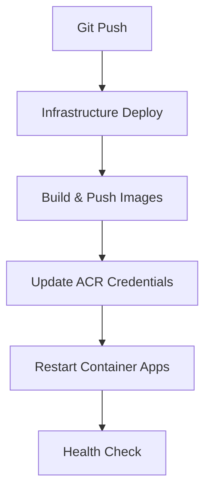

# AI Profile Photo Maker - Deployment Strategy Guide

## Overview

This document outlines the comprehensive deployment strategy for the AI Profile Photo Maker application, including different deployment options, current status, and next steps. This guide serves as the primary reference for all deployment-related activities.

## Current Status Summary

**Deployment Environment**: Azure Container Apps (V1)  
**Current Phase**: Option A Implementation (In Progress)  
**Infrastructure**: Bicep Infrastructure as Code  
**CI/CD**: PowerShell-based GitHub Actions  
**Last Update**: August 5, 2025

### 🎯 **Current Objective**
Successfully deploy the application using **Option A: Quick Fix** approach to resolve persistent ARM template validation failures.

## Deployment Options Analysis

### Option A: Quick Fix (2-Hour Implementation) ⭐ **SELECTED**

**Status**: ✅ **IMPLEMENTED & TESTING**

**Approach**: Two-phase deployment to resolve circular dependency issues
1. **Phase 1**: Deploy infrastructure with placeholder ACR credentials
2. **Phase 2**: Update Container Apps with actual ACR credentials post-deployment

**Technical Details**:
- ✅ Updated API versions from preview (`2023-05-02-preview`) to stable (`2023-05-01`)
- ✅ Removed circular dependencies (`containerRegistry.listCredentials()` calls)
- ✅ Added placeholder credentials with post-deployment update script
- ✅ Integrated credential update workflow into PowerShell deployment pipeline

**Files Modified**:
- `infrastructure/simple-deploy.bicep` - Main template fixes
- `infrastructure/update-acr-credentials.ps1` - Post-deployment credential update
- `.github/workflows/powershell-deploy.yml` - Integrated Option A workflow

**Expected Benefits**:
- ⚡ Fast resolution (2-hour implementation)
- 🛠️ Minimal architectural changes
- 🔧 Maintains current development workflow
- 📋 Addresses ARM template validation issues

**Current Workflow**:


### Option B: Production Architecture (1-2 Day Implementation)

**Status**: 🟡 **AVAILABLE AS BACKUP**

**Approach**: Complete architectural redesign with Azure best practices
- Azure Container Apps with managed identity
- Azure Container Registry integration
- Key Vault for credential management
- Proper resource dependencies

**Benefits**:
- 🏗️ Production-ready architecture
- 🛡️ Enhanced security posture
- 📈 Better scalability
- 🔧 Follows Azure best practices

**Considerations**:
- ⏱️ Longer implementation time
- 🔄 Requires extensive testing
- 📚 Additional documentation needed

## Infrastructure Components

### Core Azure Resources

| Resource | Configuration | Status | Notes |
|----------|---------------|---------|-------|
| **Resource Group** | `aiprofilemaker-v1` | ✅ Ready | Primary deployment target |
| **Container Registry** | Basic tier, admin enabled | 🔄 Deploying | Stores application images |
| **Container Apps Environment** | Standard configuration | 🔄 Deploying | Hosts container applications |
| **Backend Container App** | .NET 8 API, 0.5 CPU/1Gi | 🔄 Deploying | API application |
| **Frontend Container App** | Angular UI, 0.25 CPU/0.5Gi | 🔄 Deploying | Web application |
| **SQL Database** | Basic tier, managed identity | 🔄 Deploying | Application database |
| **Storage Account** | Standard LRS, blob storage | 🔄 Deploying | Image storage |
| **Key Vault** | Standard tier, RBAC enabled | 🔄 Deploying | Secret management |
| **Application Insights** | Standard monitoring | 🔄 Deploying | Telemetry and logging |

### Network Architecture

```
Internet
    ↓
Container Apps Environment
    ├── Frontend App (Port 80)
    │   └── Angular UI
    │
    └── Backend App (Port 80) 
        ├── .NET 8 API
        ├── SQL Database Connection
        ├── Storage Account Access
        └── Key Vault Integration
```

## Deployment Workflows

### PowerShell Deployment Workflow (Current)

**File**: `.github/workflows/powershell-deploy.yml`

**Stages**:
1. **Test** - Backend and frontend validation
2. **Infrastructure Deploy** - Bicep template deployment
3. **Image Build & Push** - Container image creation
4. **ACR Credential Update** - Option A specific step
5. **Container Restart** - Application refresh
6. **Health Check** - Deployment validation

**Key Features**:
- Windows runner for PowerShell compatibility
- Azure PowerShell module integration
- Retry logic for deployment resilience
- Comprehensive error handling
- Real-time progress reporting

### Bash Deployment Workflow (Deprecated)

**Status**: ❌ **DISABLED**
**Reason**: Persistent "content already consumed" Azure CLI errors

The bash-based deployment workflow was experiencing irresolvable HTTP client issues with Azure CLI, leading to consistent deployment failures across 12+ attempts.

## Known Issues & Solutions

### Issue 1: ARM Template Circular Dependencies

**Problem**: `containerRegistry.listCredentials().passwords[0].value` creating circular references
**Solution**: Option A two-phase deployment approach
**Status**: ✅ **RESOLVED**

### Issue 2: Preview API Version Instability

**Problem**: Using preview API versions causing validation failures
**Solution**: Updated to stable API versions (`2023-05-01`)
**Status**: ✅ **RESOLVED**

### Issue 3: Azure CLI HTTP Client Errors

**Problem**: "content already consumed" errors in bash workflow
**Solution**: Migrated to PowerShell-based deployment
**Status**: ✅ **RESOLVED**

### Issue 4: PowerShell String Termination

**Problem**: Emoji characters causing PowerShell parsing errors
**Solution**: Removed all emoji characters from PowerShell scripts
**Status**: ✅ **RESOLVED**

## Environment Configuration

### Required GitHub Secrets

| Secret | Purpose | Status |
|--------|---------|---------|
| `AZURE_CLIENT_ID` | OIDC authentication | ✅ Configured |
| `AZURE_TENANT_ID` | Azure tenant identification | ✅ Configured |
| `AZURE_SUBSCRIPTION_ID` | Target subscription | ✅ Configured |
| `SQL_ADMIN_PASSWORD` | Database administrator password | ✅ Configured |
| `JWT_SECRET` | Application JWT signing key | ✅ Configured |
| `REPLICATE_API_TOKEN` | AI service authentication | ✅ Configured |

### Environment Variables

**Development**:
- Uses SQLite database
- Local file storage
- Development API keys

**Production (V1)**:
- Azure SQL Database
- Azure Blob Storage
- Production API integrations

## Testing & Validation

### Pre-Deployment Validation

**Script**: `scripts/05-pre-deployment-validation.sh`

**Checks**:
- ✅ Azure CLI authentication
- ✅ Resource group permissions
- ✅ Required deployment files
- ✅ Bicep syntax validation
- ✅ Network connectivity
- ✅ Resource provider registration

### Post-Deployment Validation

**Health Checks**:
- Backend API health endpoint (`/health`)
- Frontend application loading
- Database connectivity
- Storage account access
- Application Insights telemetry

### Monitoring & Observability

**Application Insights**:
- Request/response telemetry
- Error tracking and alerting
- Performance metrics
- Custom application events

**Log Analytics**:
- Centralized logging
- Query and analysis capabilities
- Alert rule configuration

## Troubleshooting Guide

### Common Deployment Failures

#### 1. Infrastructure Deployment Timeout
**Symptoms**: Bicep deployment exceeds timeout limits
**Solution**: Check resource dependencies, review error logs
**Command**: `az deployment group show --resource-group aiprofilemaker-v1 --name [deployment-name]`

#### 2. Container Image Pull Failures
**Symptoms**: Container apps fail to start, image pull errors
**Solution**: Verify ACR credentials, check image availability
**Command**: `az containerapp revision list --name [app-name] --resource-group aiprofilemaker-v1`

#### 3. Database Connection Issues
**Symptoms**: Backend API cannot connect to SQL Database
**Solution**: Verify connection strings, check firewall rules
**Command**: `az sql server firewall-rule list --resource-group aiprofilemaker-v1 --server [server-name]`

#### 4. Key Vault Access Denied
**Symptoms**: Application cannot retrieve secrets
**Solution**: Verify managed identity permissions
**Command**: `az keyvault set-policy --name [vault-name] --object-id [managed-identity-id] --secret-permissions get list`

### Deployment Recovery Procedures

#### Option A Recovery Steps
1. **Check deployment status**: Monitor GitHub Actions logs
2. **Verify ACR credentials**: Ensure credential update script executed
3. **Restart applications**: Manual container app restart if needed
4. **Validate health**: Check application endpoints

#### Emergency Rollback
1. **Identify last working deployment**
2. **Revert infrastructure changes**: Re-deploy previous Bicep template
3. **Update application configuration**: Restore previous settings
4. **Validate functionality**: Comprehensive health checks

## Next Steps & Roadmap

### Immediate Actions (Current Sprint)
1. ✅ Complete Option A implementation
2. 🔄 **Monitor deployment progress**
3. 🔄 **Validate application functionality**
4. 🔄 **Document lessons learned**

### Short-term Improvements (Next Sprint)
1. 📋 Implement automated health checks
2. 📋 Add deployment notification webhooks
3. 📋 Create deployment dashboard
4. 📋 Enhance error reporting

### Medium-term Enhancements (Next Month)
1. 📋 Consider Option B implementation
2. 📋 Add multi-environment support
3. 📋 Implement blue-green deployments
4. 📋 Add automated rollback capabilities

### Long-term Strategy (Next Quarter)
1. 📋 Migrate to microservices architecture
2. 📋 Implement GitOps workflows
3. 📋 Add infrastructure testing
4. 📋 Multi-region deployment support

## Team Responsibilities

### Development Team
- Maintain application code quality
- Ensure Docker images build successfully
- Update deployment documentation
- Report deployment issues

### DevOps Team
- Monitor deployment pipeline health
- Maintain infrastructure templates
- Resolve deployment failures
- Optimize deployment performance

### Operations Team
- Monitor application health post-deployment
- Manage production environment
- Handle incident response
- Maintain monitoring and alerting

## Success Metrics

### Deployment Performance
- **Deployment Time**: Target < 15 minutes
- **Success Rate**: Target > 95%
- **Rollback Time**: Target < 5 minutes
- **Mean Time to Recovery**: Target < 30 minutes

### Application Health
- **Uptime**: Target > 99%
- **Response Time**: Target < 500ms
- **Error Rate**: Target < 1%
- **User Completion Rate**: Target > 90%

## Documentation References

### Related Documents
- [Cloud Architecture](./cloud-architecture.md) - Azure infrastructure design
- [Project Plan](./PROJECT_PLAN.md) - Overall project roadmap
- [API Reference](./API_REFERENCE.md) - Backend API documentation

### External Resources
- [Azure Container Apps Documentation](https://docs.microsoft.com/en-us/azure/container-apps/)
- [Azure DevOps Best Practices](https://docs.microsoft.com/en-us/azure/devops/)
- [Bicep Template Reference](https://docs.microsoft.com/en-us/azure/azure-resource-manager/bicep/)

---

**Document Status**: ✅ **ACTIVE**  
**Last Updated**: August 5, 2025  
**Next Review**: August 12, 2025  
**Maintained By**: DevOps Team

*This document is automatically updated as deployment strategies evolve. For questions or clarifications, refer to the troubleshooting section or contact the DevOps team.*