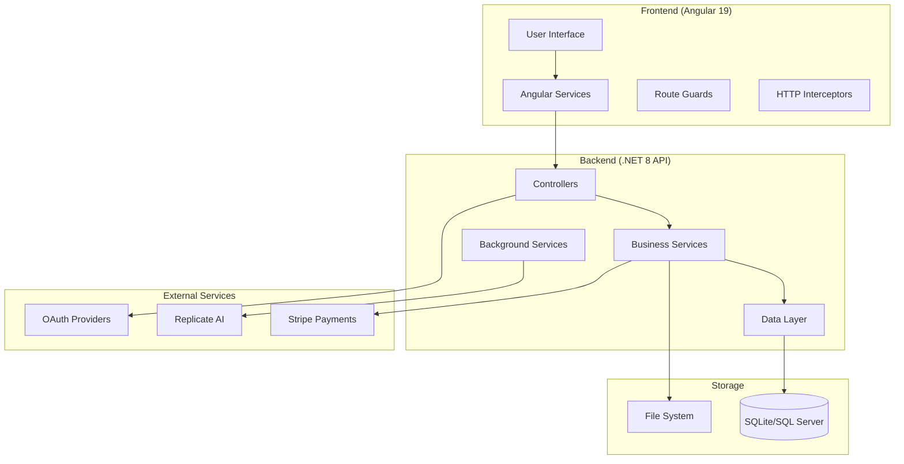
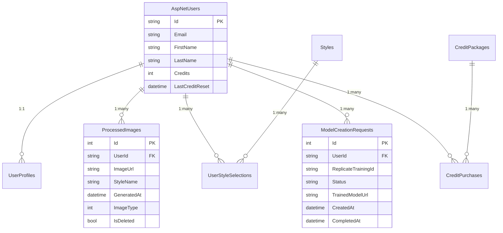
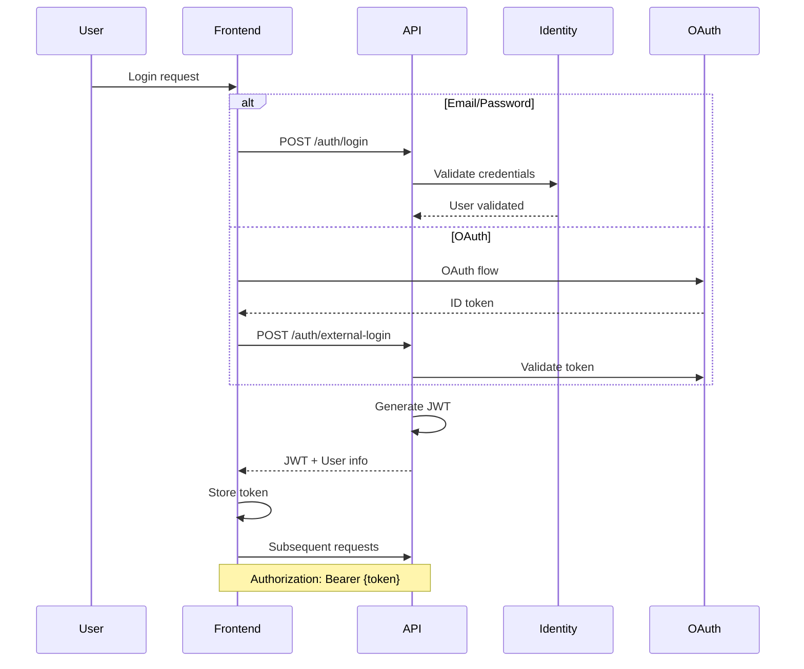
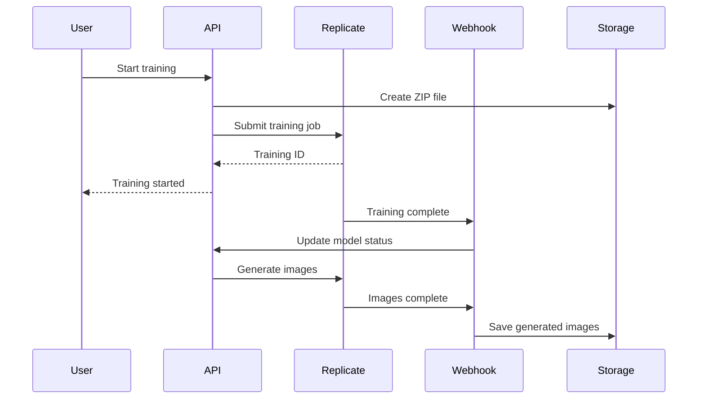
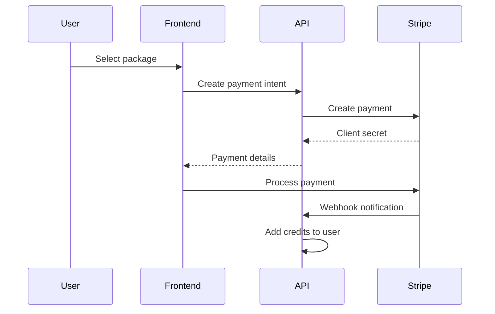

# Architecture Overview

## System Architecture

The AI Profile Photo Maker is built as a modern full-stack web application using a microservices-inspired architecture with clear separation between frontend and backend concerns.



## Technology Stack

### Frontend
- **Framework**: Angular 19 with TypeScript
- **UI Components**: Angular Material
- **State Management**: RxJS with Services
- **Styling**: SASS with modern @use syntax
- **Build Tool**: Angular CLI with Webpack
- **Testing**: Jasmine/Karma
- **Authentication**: JWT with OAuth integration

### Backend
- **Framework**: .NET 8 Web API
- **Database**: Entity Framework Core (SQLite dev, SQL Server prod)
- **Authentication**: ASP.NET Core Identity with JWT
- **Background Jobs**: Hosted Services
- **API Documentation**: Swagger/OpenAPI
- **Testing**: xUnit

### External Integrations
- **AI Processing**: Replicate.com API
- **Payments**: Stripe
- **OAuth**: Google, Facebook, Apple
- **File Storage**: Local filesystem (Azure Blob planned)

## Directory Structure

```
AI.ProfilePhotoMaker/
├── AI.ProfilePhotoMaker.API/          # Backend API
│   ├── Controllers/                   # API endpoints
│   ├── Services/                      # Business logic
│   ├── Models/                        # Data models & DTOs
│   ├── Data/                         # EF Core context
│   └── Migrations/                   # Database migrations
│
├── AI.ProfilePhotoMaker.UI/          # Frontend Application
│   ├── src/app/
│   │   ├── components/               # Reusable components
│   │   ├── pages/                    # Route components
│   │   ├── services/                 # HTTP & business services
│   │   ├── guards/                   # Route protection
│   │   └── shared/                   # Common utilities
│   └── src/environments/             # Environment configs
│
├── AI.ProfilePhotoMaker.API.Tests/   # Backend tests
└── docs/                             # Documentation
```

## Data Architecture

### Database Schema



### File System Structure

```
/storage/
├── uploads/{userId}/                 # Original selfie uploads
│   └── {imageId}_selfie.{ext}
├── training-zips/                    # AI training data
│   └── {userId}.zip
├── generated/{userId}/               # AI generated images
│   └── {style}_{timestamp}_{hash}.png
├── enhanced/{userId}/                # Enhanced photos
│   └── {imageId}_enhanced.{ext}
└── style-previews/                   # Style example images
    └── {styleName}.jpg
```

## Service Architecture

### Backend Services

#### Core Services
```csharp
// Authentication & User Management
IAuthService              // JWT token management
IUserContextService       // Current user context
UserProfileRepository     // User data operations

// Image Processing
IImageProcessingService   // File validation & processing
IImageDownloadService     // External image downloads
IReplicateApiClient      // AI model integration

// Business Logic
IBasicTierService        // Free tier credit management
ICreditPackageService    // Payment processing
IRetentionPolicyService  // Data cleanup
IModelDiscoveryService   // Model synchronization
```

#### Background Services
```csharp
BasicTierBackgroundService     // Weekly credit reset
ModelCreationPollingService    // Training status updates
RetentionPolicyBackgroundService  // Automated cleanup
ModelExpirationBackgroundService  // Model lifecycle
```

### Frontend Services

#### Core Services
```typescript
// Authentication
AuthService              // Login/logout, token management
AuthGuard               // Route protection

// Data Services
ProfileService          // User profile operations
DashboardService       // Dashboard data aggregation
CreditService          // Credit balance & purchases
StyleService           // Style selection

// State Management
DashboardStateService  // Dashboard state coordination
CacheManagerService    // Client-side caching

// Utility Services
FileUploadService      // File upload handling
ImageValidationService // Client-side validation
NotificationService    // User notifications
ThemeService          // UI theme management
```

## Security Architecture

### Authentication Flow



### Security Measures

1. **API Security**
   - JWT token authentication
   - Role-based authorization
   - CORS protection
   - Request validation
   - Rate limiting

2. **Data Protection**
   - User secrets for sensitive config
   - HTTPS enforcement
   - SQL injection prevention (EF Core)
   - File upload validation

3. **OAuth Integration**
   - Secure token validation
   - Provider certificate verification
   - State parameter validation

## Integration Architecture

### External Service Integration

#### Replicate AI Integration


#### Payment Integration


## Performance Architecture

### Caching Strategy

1. **Frontend Caching**
   - HTTP response caching (5 minutes)
   - Service worker for offline capability
   - Local storage for user preferences
   - Image lazy loading

2. **Backend Caching**
   - In-memory caching for frequent queries
   - Database query optimization
   - File system caching
   - CDN integration (planned)

### Database Optimization

```sql
-- Performance indexes
CREATE INDEX idx_processed_images_user_date 
ON ProcessedImages(UserId, GeneratedAt DESC);

CREATE INDEX idx_user_style_selections 
ON UserStyleSelections(UserId);

CREATE INDEX idx_model_creation_requests_user 
ON ModelCreationRequests(UserId, Status);
```

### File Management

1. **Upload Optimization**
   - Client-side image compression
   - Progressive upload with chunking
   - Background processing

2. **Storage Optimization**
   - Automatic cleanup policies
   - Thumbnail generation
   - Compression for archived files

## Scalability Considerations

### Horizontal Scaling

1. **API Scaling**
   - Stateless API design
   - Load balancer ready
   - Database connection pooling
   - Background service distribution

2. **Frontend Scaling**
   - CDN for static assets
   - Angular build optimization
   - Lazy loading modules
   - Service worker caching

### Vertical Scaling

1. **Database Optimization**
   - Query performance monitoring
   - Index optimization
   - Connection pooling
   - Read replicas (planned)

2. **File Storage**
   - Local to cloud migration path
   - Tiered storage strategy
   - Automated archival

## Deployment Architecture

### Development Environment

```yaml
Development Stack:
  Frontend: ng serve (port 4200)
  Backend: dotnet run (port 5035)
  Database: SQLite (local file)
  Proxy: Angular dev server
  Tunneling: ngrok for OAuth testing
```

### Production Environment (Planned)

```yaml
Production Stack:
  Frontend: 
    - Angular build (optimized)
    - Served via CDN/nginx
  Backend:
    - Docker container
    - Load balanced instances
  Database:
    - SQL Server/PostgreSQL
    - Connection pooling
  Storage:
    - Azure Blob Storage
    - CDN integration
```

## Monitoring & Observability

### Logging Strategy

1. **Frontend Logging**
   - Console logging (development)
   - Error tracking service integration
   - User action analytics

2. **Backend Logging**
   - Structured logging (Serilog)
   - Request/response logging
   - Performance metrics
   - Error tracking

### Health Monitoring

```csharp
// Health check endpoints
app.MapHealthChecks("/health");
app.MapHealthChecks("/health/db", new HealthCheckOptions
{
    Predicate = check => check.Tags.Contains("database")
});
```

## Best Practices

### Code Organization

1. **Separation of Concerns**
   - Controllers handle HTTP concerns only
   - Services contain business logic
   - Repositories handle data access
   - DTOs for API contracts

2. **Dependency Injection**
   - Interface-based design
   - Scoped service lifetimes
   - Configuration injection

### Error Handling

1. **Global Error Handling**
   - Exception middleware
   - Consistent error responses
   - Logging integration

2. **Client-Side Error Handling**
   - HTTP error interceptors
   - User-friendly error messages
   - Retry mechanisms

### Testing Strategy

1. **Unit Testing**
   - Service layer testing
   - Component testing
   - Mock external dependencies

2. **Integration Testing**
   - API endpoint testing
   - Database integration
   - End-to-end workflows

## Future Enhancements

### Planned Improvements

1. **Cloud Migration**
   - Azure/AWS deployment
   - Managed database services
   - Blob storage integration

2. **Performance Optimization**
   - Redis caching layer
   - Database read replicas
   - CDN integration

3. **Feature Enhancements**
   - Real-time notifications
   - Advanced analytics
   - Mobile app support

### Scalability Roadmap

1. **Phase 1**: Single instance optimization
2. **Phase 2**: Load balanced API instances
3. **Phase 3**: Database clustering
4. **Phase 4**: Microservices architecture
