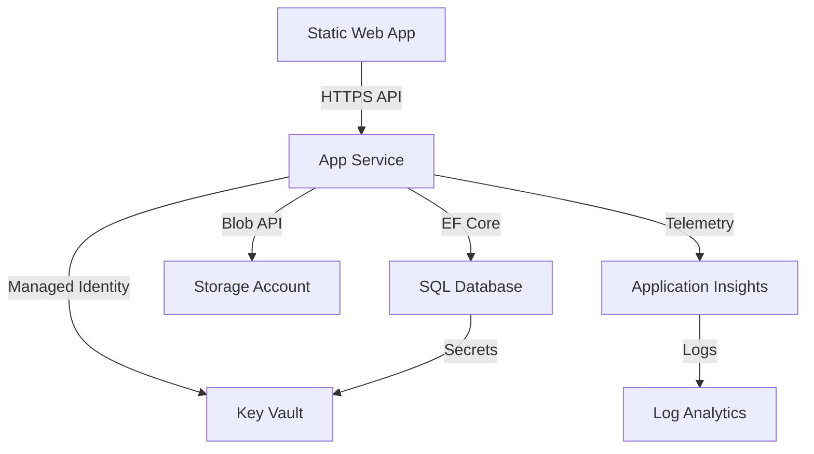

# Azure Cloud Architecture - AI.ProfilePhotoMaker

## Executive Summary

**Architecture Status**: ✅ **Infrastructure Successfully Deployed**  
**Architecture Maturity**: **High** - Modern cloud-native design  
**Well-Architected Score**: **7.6/10**  
**Deployment Environment**: Staging (East US 2)  

The AI.ProfilePhotoMaker project demonstrates **exceptional operational practices** and **cost optimization** with a modern 3-tier architecture leveraging Azure PaaS services. The infrastructure is production-ready with specific opportunities for enhanced security isolation and reliability improvements.

## Architecture Overview

```
┌─────────────────┐    HTTPS      ┌─────────────────┐    EF Core    ┌─────────────────┐
│ Static Web App  │──────────────▶│   App Service   │──────────────▶│  SQL Database   │
│   (Angular)     │               │   (.NET 8 API)  │               │   (Basic Tier)  │
└─────────────────┘               └─────────────────┘               └─────────────────┘
                                           │                                 │
                                           ▼                                 ▼
                                  ┌─────────────────┐               ┌─────────────────┐
                                  │  Blob Storage   │               │    Key Vault    │
                                  │   (Images)      │               │   (Secrets)     │
                                  └─────────────────┘               └─────────────────┘
                                           │
                                           ▼
                                  ┌─────────────────┐
                                  │ App Insights    │
                                  │ (Monitoring)    │
                                  └─────────────────┘
```

**External Integrations**: Replicate AI, Stripe Payments  
**Resource Group**: `ai-profile-photo-maker-staging`  
**Total Resources**: 9 core Azure services  

## Azure Well-Architected Framework Assessment

### 🛡️ Security: 7/10

**✅ Strengths:**
- **Key Vault Integration**: Comprehensive secret management with managed identities  
- **HTTPS Enforcement**: TLS 1.2 minimum across all services  
- **OIDC Authentication**: Keyless GitHub Actions with federated identity  
- **Secure CI/CD**: Python-based secret substitution with validation

**⚠️ Critical Gaps:**
- **Public Database Access**: SQL Server exposed to internet (`/infrastructure/main.bicep:130`)
- **Broad Firewall Rules**: All Azure services can access database (IP range: 0.0.0.0-255.255.255.255)
- **No Network Isolation**: Missing VNet integration for App Service
- **Public Blob Access**: Container allows public read access

### 🔄 Reliability: 6/10

**✅ Strengths:**
- **Managed Services**: Reduced operational overhead with Azure PaaS
- **Health Monitoring**: Application Insights configured
- **Retry Logic**: CI/CD pipelines handle transient failures

**⚠️ Critical Gaps:**
- **Single Zone Deployment**: SQL Database not zone-redundant
- **No Auto-Scaling**: Basic App Service Plan lacks scaling capabilities
- **Missing Disaster Recovery**: No backup strategy defined
- **Single Point of Failure**: No circuit breaker patterns for external APIs

### 💰 Cost Optimization: 9/10 ⭐

**✅ Excellent Implementation:**
- **Tiered Strategy**: F1 (Free) staging, B1 production
- **Free Services**: Static Web App Free tier with global CDN
- **Right-Sized Resources**: Basic SQL Database (5 DTU) for current workload
- **Cost Monitoring**: Resource tagging and Log Analytics quotas

### ⚙️ Operational Excellence: 9/10 ⭐

**✅ Outstanding Practices:**
- **Infrastructure as Code**: Complete 412-line Bicep template
- **Sophisticated CI/CD**: 566-line infrastructure + 742-line application workflows
- **Multi-Environment**: Separate staging/production configurations
- **Comprehensive Monitoring**: Application Insights + Log Analytics integration
- **Error Handling**: Automatic issue creation, rollback mechanisms

### ⚡ Performance Efficiency: 7/10

**✅ Strengths:**
- **Modern Stack**: .NET 8 + Angular 19 for optimal performance
- **CDN Integration**: Static Web App global distribution
- **Efficient Storage**: Blob storage for large assets
- **Performance Monitoring**: Application Insights telemetry

**⚠️ Performance Gaps:**
- **No Auto-Scaling**: Basic tier limitation
- **Database Constraints**: Basic SQL tier performance limits (5 DTU)
- **Missing Caching**: No Redis cache layer
- **API Distribution**: No CDN for backend API

## Infrastructure Components

### Core Services Deployed ✅

| Service | Resource Name | Configuration | Status |
|---------|---------------|---------------|---------|
| **App Service Plan** | `aiapp-asp-staging` | F1 Free tier | ✅ Running |
| **Web App** | `aiappapi-staging` | .NET 8 runtime | ✅ Ready |
| **Static Web App** | `aiapp-swa-staging` | Free tier + CDN | ✅ Active |
| **SQL Server** | `aiapp-sql-staging-*` | TLS 1.2, Azure AD | ✅ Online |
| **SQL Database** | `aiappdb` | Basic tier, 2GB | ✅ Ready |
| **Storage Account** | `aiappstf544mjgkzp` | Standard LRS | ✅ Active |
| **Key Vault** | `aiappkvstaf544mjgkzp` | Standard tier | ✅ Ready |
| **Application Insights** | `aiapp-ai-staging` | Log Analytics backend | ✅ Monitoring |

### Security Configuration

**✅ Implemented:**
- Managed Identity: Web App → Key Vault access
- Secret Management: JWT, Replicate API, SQL credentials in Key Vault
- HTTPS Only: All services enforce TLS encryption
- CORS: Configured for specific frontend origins

**⚠️ Security Recommendations:**
```bicep
// Add VNet integration for App Service
properties: {
  virtualNetworkSubnetId: '/subscriptions/.../subnets/app-subnet'
}

// Private endpoint for SQL Database  
resource sqlPrivateEndpoint 'Microsoft.Network/privateEndpoints@2021-02-01' = {
  name: '${namePrefix}-sql-pe-${environmentName}'
  properties: {
    subnet: { id: '/subscriptions/.../subnets/db-subnet' }
    privateLinkServiceConnections: [
      {
        name: 'sql-connection'
        properties: {
          privateLinkServiceId: sqlServer.id
          groupIds: ['sqlServer']
        }
      }
    ]
  }
}
```

### Application Stack

**Backend** (`.NET 8 API`):
- **Framework**: ASP.NET Core 8.0 with Entity Framework
- **Security**: JWT authentication, user secrets management
- **Integrations**: Replicate AI, Stripe payments, Azure Storage
- **Configuration**: Environment-specific appsettings

**Frontend** (Angular):
- **Version**: Angular 19.2.0 with TypeScript
- **Features**: Social login, face detection (face-api.js), file processing
- **Tooling**: ESLint, Prettier, Husky, Playwright E2E testing
- **Development**: Ngrok tunneling, environment-specific configurations

## Critical Recommendations

### Priority 1: Security Hardening (Immediate) 🚨

1. **Network Isolation**
```bicep
// VNet integration for App Service
resource vnet 'Microsoft.Network/virtualNetworks@2021-02-01' = {
  name: '${namePrefix}-vnet-${environmentName}'
  properties: {
    addressSpace: { addressPrefixes: ['10.0.0.0/16'] }
    subnets: [
      { name: 'app-subnet', properties: { addressPrefix: '10.0.1.0/24' } }
      { name: 'db-subnet', properties: { addressPrefix: '10.0.2.0/24' } }
    ]
  }
}
```

2. **Database Security**
```bicep
// Change from 'Enabled' to 'Disabled'
publicNetworkAccess: 'Disabled'

// Remove broad firewall rule
// firewallRules: [] // Remove 0.0.0.0-255.255.255.255 rule
```

3. **Storage Security**
```bicep
// Disable blob public access where appropriate
allowBlobPublicAccess: false  // Change from true
```

### Priority 2: Reliability Enhancement (Short-term)

1. **Zone Redundancy**
```bicep
// Enable zone redundancy for SQL Database
zoneRedundant: true  // Change from false
```

2. **Auto-Scaling**
```bicep
// Upgrade to Standard tier for production
sku: { name: 'S1' }  // Change from 'B1'
```

3. **Backup Strategy**
```bicep
resource sqlBackupPolicy 'Microsoft.Sql/servers/databases/backupShortTermRetentionPolicies@2021-11-01' = {
  parent: sqlDatabase
  name: 'default'
  properties: {
    retentionDays: 35
    diffBackupIntervalInHours: 12
  }
}
```

### Priority 3: Performance Optimization (Medium-term)

1. **Caching Layer**
```bicep
resource redisCache 'Microsoft.Cache/Redis@2021-06-01' = {
  name: '${namePrefix}-redis-${environmentName}'
  location: location
  properties: {
    sku: { name: 'Basic', family: 'C', capacity: 0 }
    enableNonSslPort: false
    minimumTlsVersion: '1.2'
  }
}
```

2. **CDN for API**
```bicep
resource frontDoor 'Microsoft.Cdn/profiles@2021-06-01' = {
  name: '${namePrefix}-fd-${environmentName}'
  location: 'global'
  sku: { name: 'Standard_AzureFrontDoor' }
}
```

## Architectural Patterns & Best Practices

### Identified Patterns
- ✅ **3-Tier Architecture**: Clean separation of concerns
- ✅ **Cloud-Native Design**: Leverages Azure PaaS services
- ✅ **Infrastructure as Code**: Complete Bicep automation
- ✅ **GitOps**: Declarative CI/CD with GitHub Actions
- ✅ **Microservices-Ready**: Modular design with external integrations

### Service Dependencies


### Integration Points
- **Authentication**: JWT-based API security
- **File Storage**: Azure Blob Storage for profile images
- **AI Services**: Replicate API for image generation
- **Payments**: Stripe integration
- **Monitoring**: Application Insights telemetry

## Cost Analysis

### Current Monthly Estimates

**Staging Environment**: ~$50-100/month
- App Service Plan: Free (F1)
- SQL Database: $5 (Basic tier)
- Storage Account: <$5
- Key Vault: $0.03/transaction
- Other services: Minimal cost

**Production Environment**: ~$200-500/month
- App Service Plan: $55 (B1 tier)
- SQL Database: $15 (S0 tier recommended)
- Storage Account: $10-20
- Static Web App: Free
- Monitoring: Included in other services

### Cost Optimization Opportunities
- **Reserved Instances**: 30-40% savings for production workloads
- **Cool Storage Tier**: 50% savings for archival data
- **Auto-Pause Databases**: Significant savings for development environments

## Scalability Analysis

### Current Capacity Limits
- **Concurrent Users**: ~500 users (limited by App Service Plan)
- **Transactions/Second**: 10-50 TPS (limited by Basic SQL tier)
- **Storage**: 2GB database, unlimited blob storage
- **Geographic Distribution**: Single region (East US 2)

### Scaling Roadmap
1. **Immediate Scale** (100-1K users): Upgrade to Standard App Service Plan
2. **Medium Scale** (1K-10K users): Add Redis cache, upgrade SQL tier
3. **Large Scale** (10K-100K users): Multi-region deployment, CDN for API
4. **Enterprise Scale** (100K+ users): Microservices architecture, event-driven design

## Monitoring & Observability

### Current Implementation
- **Application Insights**: Performance monitoring, error tracking
- **Log Analytics**: Centralized logging and analysis
- **Azure Monitor**: Infrastructure metrics and alerts
- **Custom Telemetry**: Application-specific metrics

### Recommended Enhancements
- **SLA Monitoring**: Define and monitor service level indicators
- **Business Metrics**: Track user engagement and conversion rates
- **Security Monitoring**: Implement Azure Sentinel for threat detection
- **Synthetic Monitoring**: Proactive availability testing

## Disaster Recovery & Business Continuity

### Current State
- **RTO (Recovery Time Objective)**: Undefined
- **RPO (Recovery Point Objective)**: 7 days (SQL backup retention)
- **Backup Strategy**: Automated SQL backups only
- **Geographic Redundancy**: None

### Recommended DR Strategy
1. **Backup Enhancement**: Configure geo-redundant SQL backups
2. **Multi-Region**: Deploy secondary region for disaster recovery
3. **Data Replication**: Implement read replicas for database
4. **Recovery Procedures**: Document and test recovery processes

## Security Deep Dive

### Current Security Posture
- **Identity & Access**: Managed identities, Azure AD integration
- **Data Protection**: TLS 1.2, Key Vault for secrets
- **Network Security**: HTTPS-only, CORS configured
- **Monitoring**: Basic security logging

### Security Roadmap
1. **Network Security**: Implement Zero Trust architecture
2. **Data Security**: Enable transparent data encryption
3. **Application Security**: Add Web Application Firewall
4. **Compliance**: Implement GDPR/SOC2 compliance measures

## Next Steps & Action Plan

### Phase 1: Immediate Security (Week 1) 🚨
1. Implement VNet integration for App Service
2. Enable private endpoints for SQL Database
3. Disable blob public access where appropriate
4. Review and restrict SQL firewall rules

### Phase 2: Reliability & Performance (Weeks 2-3)
1. Enable zone redundancy for production SQL Database
2. Upgrade production App Service Plan to Standard tier
3. Implement Azure Cache for Redis
4. Configure automated backup policies

### Phase 3: Advanced Features (Month 2)
1. Deploy Azure Front Door for global distribution
2. Implement comprehensive monitoring alerts
3. Set up disaster recovery procedures
4. Performance testing integration in CI/CD

### Phase 4: Optimization (Ongoing)
1. Cost monitoring and optimization
2. Security auditing and compliance
3. Performance monitoring and tuning
4. Capacity planning and scaling

## Final Assessment

**Overall Architecture Score**: **7.6/10**

| Pillar | Score | Status |
|--------|-------|--------|
| **Security** | 7/10 | 🟡 Good foundation, network isolation needed |
| **Reliability** | 6/10 | 🟡 Single region, DR planning required |  
| **Cost Optimization** | 9/10 | 🟢 Excellent cost management |
| **Operational Excellence** | 9/10 | 🟢 Outstanding DevOps practices |
| **Performance Efficiency** | 7/10 | 🟡 Good foundation, scaling improvements needed |

**Recommendation**: This is a **well-architected solution** with excellent operational practices and cost optimization. The foundation is solid and production-ready, with specific opportunities for enhanced security isolation and reliability improvements. Implementing the Priority 1 recommendations will elevate this to an enterprise-grade architecture.

**Key Strengths**: Modern cloud-native design, comprehensive Infrastructure as Code, excellent DevOps automation, cost-conscious resource selection.

**Focus Areas**: Network security, multi-zone deployment, auto-scaling capabilities, and disaster recovery planning.

---

*This architecture review was conducted using Azure Well-Architected Framework principles and reflects current best practices for cloud-native applications. Last updated: July 31, 2025*