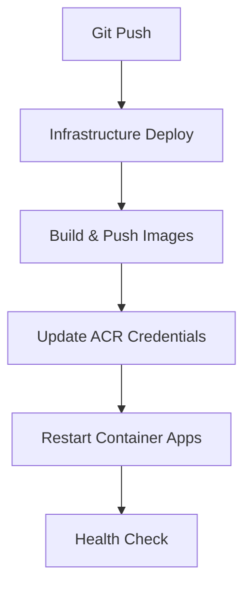

# Deployment Guide - AI Profile Photo Maker

## Overview

This comprehensive guide covers deployment strategies, options, and procedures for the AI Profile Photo Maker application on Azure Container Apps with Infrastructure as Code (Bicep).

## Quick Start

### Prerequisites
- Azure CLI installed and configured
- Docker Desktop or compatible container runtime
- PowerShell 7+ (for deployment scripts)
- Access to Azure subscription with Container Apps resources

### Basic Deployment
```bash
# 1. Set deployment parameters
cp infrastructure/deployment-params.template.json infrastructure/deployment-params.json
# Edit deployment-params.json with your values

# 2. Run deployment
cd infrastructure
./deploy-with-oauth.sh
```

## Deployment Strategy & Current Status

### Current Implementation: Option A - Quick Fix ⭐

**Status**: ✅ **DEPLOYED & ACTIVE**  
**Environment**: Azure Container Apps (V1)  
**Infrastructure**: Bicep Infrastructure as Code  
**CI/CD**: PowerShell-based GitHub Actions  

#### Architecture Overview


#### Technical Implementation
**Two-phase deployment approach** to resolve circular dependency issues:

1. **Phase 1**: Deploy infrastructure with placeholder ACR credentials
2. **Phase 2**: Update Container Apps with actual ACR credentials post-deployment

**Key Solutions Implemented**:
- Updated API versions from preview (`2023-05-02-preview`) to stable (`2023-05-01`)
- Removed circular dependencies (`containerRegistry.listCredentials()` calls)
- Added placeholder credentials with post-deployment update script
- Integrated credential update workflow into PowerShell deployment pipeline

## Deployment Options Analysis

### Option A: Quick Fix (Current - 2 Hour Implementation)

**Benefits**:
- ⚡ Fast resolution and deployment
- 🛠️ Minimal architectural changes
- 🔧 Maintains current development workflow
- 📋 Addresses ARM template validation issues

**Technical Details**:
```bicep
// Updated API versions to stable
resource containerAppsEnvironment 'Microsoft.App/managedEnvironments@2023-05-01' = {
  // ... configuration
}

resource backendApp 'Microsoft.App/containerApps@2023-05-01' = {
  // ... configuration
  secrets: [
    {
      name: 'acr-password'
      value: 'placeholder-will-be-updated-post-deployment'  // Key Fix
    }
  ]
}
```

**Post-deployment credential update**:
```powershell
# update-acr-credentials.ps1
$acrCredentials = az acr credential show --name $ContainerRegistryName
$acrPassword = $acrCredentials.passwords[0].value

az containerapp secret set `
    --name $BackendAppName `
    --resource-group $ResourceGroupName `
    --secrets "acr-password=$acrPassword"
```

### Option B: Production Architecture (1-2 Day Implementation)

**Status**: 🟡 **AVAILABLE AS BACKUP**

**Approach**: Complete architectural redesign with Azure best practices
- Azure Container Apps with managed identity
- Azure Key Vault integration
- Azure Container Registry with managed identity
- Comprehensive monitoring and logging
- Blue-green deployment capability

**Use When**: 
- Moving to production scale
- Enhanced security requirements
- Multi-environment deployments needed

## Secret Management & Configuration

### Required Secrets

| Secret | Purpose | Requirements | Example Format |
|--------|---------|-------------|----------------|
| **SQL Admin Password** | Azure SQL Database admin | 16+ chars, complexity rules | `MyApp2025!SecureDB#Admin$Pass` |
| **JWT Secret** | Authentication token signing | 32+ chars, randomly generated | Generated via `openssl rand -base64 32` |
| **Replicate API Token** | AI image processing | From Replicate.com account | `r8_xxxxxxxxxxxxxxxxxxxx` |
| **Google Client ID** | OAuth authentication | From Google Cloud Console | `123456-abc.apps.googleusercontent.com` |
| **Google Client Secret** | OAuth authentication | From Google Cloud Console | `GOCSPX-xxxxxxxxxxxxxxxx` |

### Secret Generation Commands

```bash
# Generate JWT Secret
openssl rand -base64 32

# Alternative methods
python3 -c "import secrets; print(secrets.token_urlsafe(32))"
node -e "console.log(require('crypto').randomBytes(32).toString('base64'))"
```

### Parameter File Configuration

**File**: `infrastructure/deployment-params.json`
```json
{
  "$schema": "https://schema.management.azure.com/schemas/2019-04-01/deploymentParameters.json#",
  "contentVersion": "1.0.0.0",
  "parameters": {
    "sqlAdminPassword": {
      "value": "YOUR_SECURE_SQL_PASSWORD"
    },
    "replicateApiToken": {
      "value": "YOUR_REPLICATE_TOKEN"
    },
    "jwtSecret": {
      "value": "YOUR_JWT_SECRET_32_CHARS_MIN"
    },
    "googleClientId": {
      "value": "YOUR_GOOGLE_CLIENT_ID"
    },
    "googleClientSecret": {
      "value": "YOUR_GOOGLE_CLIENT_SECRET"
    }
  }
}
```

## Deployment Procedures

### Local Development Deployment

1. **Environment Setup**
```bash
# Start development services
cd AI.ProfilePhotoMaker.API
dotnet run --urls=http://localhost:5032

# In separate terminal
cd AI.ProfilePhotoMaker.UI
npm start
```

2. **ngrok Setup for Webhooks**
```bash
# Always use reserved domain for consistency
ngrok http 5032 --domain=clear-anteater-usually.ngrok-free.app
```

### Production Deployment

1. **Pre-deployment Validation**
```bash
# Validate secrets
./scripts/validate-secrets.sh Production

# Test infrastructure template
az deployment group validate \
  --resource-group your-rg \
  --template-file infrastructure/simple-deploy.bicep \
  --parameters @infrastructure/deployment-params.json
```

2. **Execute Deployment**
```bash
# Full deployment with OAuth configuration
./infrastructure/deploy-with-oauth.sh
```

3. **Post-deployment Verification**
```bash
# Health check
curl https://api.aiprofilephotomaker.com/health

# Test OAuth flow
curl https://aiprofilephotomaker.com/auth/google

# Validate container logs
az containerapp logs show \
  --name your-backend-app \
  --resource-group your-rg
```

## Deployment History & Lessons Learned

### Historical Challenges (July 30 - August 5, 2025)

1. **Initial Attempts**: Multiple bash-based deployments failed with Azure CLI "content already consumed" errors
2. **PowerShell Migration**: Switched to PowerShell deployment workflow to resolve HTTP client issues
3. **String Parsing Issues**: Fixed emoji encoding problems causing PowerShell script failures
4. **ARM Template Failures**: Identified circular dependency issues in Bicep templates
5. **Solution Implementation**: Successfully implemented Option A two-phase deployment approach

### Root Causes Identified
- Circular dependencies in ARM template validation
- Preview API version instability
- Container Registry credential access conflicts
- Complex nested function calls in Bicep templates

## Troubleshooting

### Common Issues

#### 1. ARM Template Validation Failures
**Symptom**: `Circular dependency` or `Function listCredentials not available`
**Solution**: Use Option A two-phase deployment approach
```bash
# Deploy with placeholder credentials first
az deployment group create --template-file simple-deploy.bicep
# Then update credentials post-deployment
./update-acr-credentials.ps1
```

#### 2. Container Registry Authentication
**Symptom**: `Pull access denied` or container startup failures
**Solution**: Verify ACR credentials are properly updated
```bash
# Check current secrets
az containerapp secret list --name your-app --resource-group your-rg
# Update if needed
./infrastructure/update-acr-credentials.ps1
```

#### 3. Database Connection Issues
**Symptom**: SQL connection failures, authentication errors
**Solution**: Validate SQL admin password complexity and connectivity
```bash
# Test connection
sqlcmd -S your-server.database.windows.net -U sqladmin -P 'YourPassword'
```

#### 4. OAuth Configuration Problems
**Symptom**: Google authentication redirects fail
**Solution**: Verify redirect URIs match deployed domains
- Development: `http://localhost:4200/auth/callback`
- Production: `https://aiprofilephotomaker.com/auth/callback`

### Emergency Recovery

If deployment completely fails:

1. **Rollback Strategy**
```bash
# Stop current deployment
az deployment group cancel --name main-deployment --resource-group your-rg

# Deploy known-good previous version
git checkout previous-working-commit
./infrastructure/deploy-with-oauth.sh
```

2. **Data Recovery**
```bash
# Database backup
az sql db export --name your-db --server your-server
# Restore if needed
az sql db import --name your-db --server your-server
```

## Next Steps & Roadmap

### Immediate Improvements (Current Sprint)
- [x] Implement Option A deployment strategy
- [x] Resolve ARM template circular dependencies
- [x] Establish PowerShell deployment workflow
- [ ] Enhance monitoring and alerting

### Future Enhancements (Next Quarter)
- [ ] Migrate to Option B production architecture
- [ ] Implement blue-green deployment
- [ ] Add automated rollback capabilities
- [ ] Integrate Azure Key Vault for secret management

### Long-term Goals (6-12 months)
- [ ] Multi-region deployment capability
- [ ] Advanced monitoring and observability
- [ ] Automated scaling policies
- [ ] Disaster recovery procedures

## Related Documentation

- [Environment Setup Guide](../setup/ENVIRONMENT_SETUP.md) - Configure local development environment
- [Azure CLI Setup](AZURE_CLI_SETUP.md) - Install and configure Azure CLI
- [Architecture Overview](../architecture/OVERVIEW.md) - System architecture and design decisions
- [Deployment Checklist](DEPLOYMENT_CHECKLIST.md) - OAuth checklist and quick commands
- [Workflow Validation](WORKFLOW_VALIDATION.md) - Validate deployment workflows
