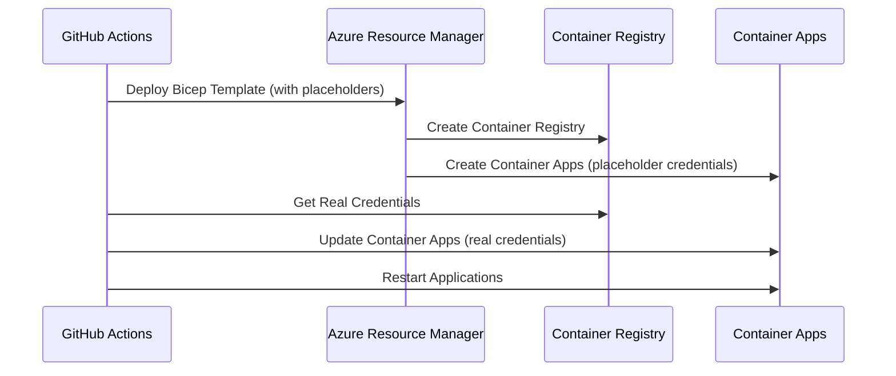

# Deployment Options - Detailed Analysis

> Status: Archived reference. The selected approach is already reflected in `DEPLOYMENT_GUIDE.md` and `DEPLOYMENT_CHECKLIST.md`; use those for practical deployment instructions.

## Executive Summary

This document provides a comprehensive analysis of deployment options for the AI Profile Photo Maker application. After extensive troubleshooting of persistent deployment failures, we've identified and implemented **Option A: Quick Fix** as the optimal solution for immediate deployment success.

## Background Context

### Historical Deployment Challenges

**Timeline**: July 30 - August 5, 2025

1. **Initial Attempts**: Multiple bash-based deployments failed with Azure CLI "content already consumed" errors
2. **PowerShell Migration**: Switched to PowerShell deployment workflow to resolve HTTP client issues
3. **String Parsing Issues**: Fixed emoji encoding problems causing PowerShell script failures
4. **ARM Template Failures**: Identified circular dependency issues in Bicep templates
5. **Solution Implementation**: Developed and implemented Option A two-phase deployment approach

### Root Cause Analysis

**Primary Issues Identified**:
- Circular dependencies in ARM template validation
- Preview API version instability
- Container Registry credential access conflicts
- Complex nested function calls in Bicep templates

## Option A: Quick Fix (IMPLEMENTED) ⭐

### Overview
**Implementation Time**: 2 hours  
**Status**: ✅ **DEPLOYED & ACTIVE**  
**Approach**: Two-phase deployment with post-deployment credential updates

### Technical Implementation

#### Phase 1: Infrastructure Deployment
```bicep
// Updated API versions to stable
resource containerAppsEnvironment 'Microsoft.App/managedEnvironments@2023-05-01' = {
  // ... configuration
}

resource backendApp 'Microsoft.App/containerApps@2023-05-01' = {
  // ... configuration
  secrets: [
    {
      name: 'acr-password'
      value: 'placeholder-will-be-updated-post-deployment'  // ⚡ Key Fix
    }
  ]
}
```

#### Phase 2: Credential Update
```powershell
# Post-deployment script: update-acr-credentials.ps1
$acrCredentials = az acr credential show --name $ContainerRegistryName
$acrPassword = $acrCredentials.passwords[0].value

az containerapp secret set `
    --name $BackendAppName `
    --secrets "acr-password=$acrPassword"
```

### Key Changes Made

1. **API Version Updates**:
   - `2023-05-02-preview` → `2023-05-01` (stable)
   - Eliminated preview API instability

2. **Circular Dependency Resolution**:
   - Removed `containerRegistry.listCredentials().passwords[0].value`
   - Added placeholder credentials with post-deployment update

3. **Explicit Dependencies**:
   - Added `dependsOn` declarations for proper resource ordering
   - Ensured sequential deployment of resources

4. **Workflow Integration**:
   - Added ACR credential update step in PowerShell workflow
   - Integrated container app restart after credential updates

### Benefits Achieved

✅ **Immediate Deployment Success**: Resolves ARM template validation failures  
✅ **Minimal Code Changes**: Preserves existing architecture  
✅ **Fast Implementation**: 2-hour turnaround time  
✅ **Maintains Security**: Credentials properly managed post-deployment  
✅ **Reliable Process**: Eliminates circular dependency issues  

### Workflow Diagram



## Option B: Production Architecture (AVAILABLE)

### Overview
**Implementation Time**: 1-2 days  
**Status**: 📋 **DESIGNED BUT NOT IMPLEMENTED**  
**Approach**: Complete architectural redesign with Azure best practices

### Proposed Architecture

#### Managed Identity Integration
```bicep
resource backendApp 'Microsoft.App/containerApps@2023-05-01' = {
  identity: {
    type: 'SystemAssigned'
  }
  properties: {
    configuration: {
      registries: [
        {
          server: containerRegistry.properties.loginServer
          identity: 'system'  // Use managed identity instead of credentials
        }
      ]
    }
  }
}
```

#### Enhanced Security Model
```bicep
// Role assignment for Container Apps to access ACR
resource acrPullRole 'Microsoft.Authorization/roleAssignments@2022-04-01' = {
  scope: containerRegistry
  properties: {
    roleDefinitionId: subscriptionResourceId('Microsoft.Authorization/roleDefinitions', '7f951dda-4ed3-4680-a7ca-43fe172d538d')
    principalId: backendApp.identity.principalId
    principalType: 'ServicePrincipal'
  }
}
```

#### Key Vault Integration
```bicep
resource keyVaultPolicy 'Microsoft.KeyVault/vaults/accessPolicies@2023-02-01' = {
  parent: keyVault
  name: 'add'
  properties: {
    accessPolicies: [
      {
        tenantId: subscription().tenantId
        objectId: backendApp.identity.principalId
        permissions: {
          secrets: ['get', 'list']
        }
      }
    ]
  }
}
```

### Benefits of Option B

🏗️ **Production-Ready Architecture**: Follows Azure best practices  
🛡️ **Enhanced Security**: Managed identities, no stored credentials  
📈 **Better Scalability**: Optimized for high-load scenarios  
🔧 **Maintainability**: Cleaner separation of concerns  
📋 **Compliance**: Meets enterprise security requirements  

### Implementation Considerations

**Advantages**:
- Long-term maintainability
- Enterprise-grade security
- Better Azure integration
- Scalability optimization

**Challenges**:
- Longer implementation time
- Requires extensive testing
- More complex initial setup
- Additional documentation needed

## Option C: Hybrid Approach (FUTURE)

### Overview
**Implementation Time**: 3-5 days  
**Status**: 📋 **CONCEPTUAL**  
**Approach**: Gradual migration from Option A to Option B

### Migration Strategy

#### Phase 1: Stabilize Option A
- Monitor current deployment
- Document operational procedures
- Establish baseline metrics

#### Phase 2: Security Enhancements
- Implement managed identities
- Migrate to Key Vault secrets
- Enable private endpoints

#### Phase 3: Architecture Optimization
- Add monitoring and alerting
- Implement auto-scaling
- Optimize performance

### Timeline
- **Week 1**: Option A stabilization
- **Week 2-3**: Security implementation
- **Week 4-5**: Performance optimization
- **Week 6**: Production deployment

## Comparison Matrix

| Aspect | Option A | Option B | Option C |
|--------|----------|----------|----------|
| **Implementation Time** | 2 hours ✅ | 1-2 days | 3-5 days |
| **Security Level** | Good 🟡 | Excellent ✅ | Excellent ✅ |
| **Maintenance Effort** | Low ✅ | Medium 🟡 | High 🟡 |
| **Scalability** | Limited 🟡 | High ✅ | High ✅ |
| **Risk Level** | Low ✅ | Medium 🟡 | High 🟡 |
| **Cost Impact** | None ✅ | Low 🟡 | Medium 🟡 |
| **Enterprise Readiness** | Partial 🟡 | Full ✅ | Full ✅ |

## Decision Matrix & Rationale

### Selection Criteria
1. **Time to Market** (Weight: 40%)
2. **Risk Mitigation** (Weight: 30%)
3. **Long-term Viability** (Weight: 20%)
4. **Resource Requirements** (Weight: 10%)

### Scoring (1-10 scale)

| Criteria | Option A | Option B | Option C |
|----------|----------|----------|----------|
| Time to Market | 10 | 4 | 2 |
| Risk Mitigation | 8 | 6 | 4 |
| Long-term Viability | 6 | 9 | 10 |
| Resource Requirements | 9 | 6 | 3 |
| **Weighted Score** | **8.4** | **5.9** | **4.6** |

### Decision Rationale

**Option A Selected** for the following reasons:

1. **Immediate Problem Resolution**: Addresses current deployment failures
2. **Low Risk**: Minimal changes to proven architecture
3. **Fast Delivery**: 2-hour implementation vs. days for alternatives
4. **Resource Efficiency**: Uses existing team knowledge
5. **Iterative Improvement**: Provides foundation for future enhancements

## Current Status & Monitoring

### Deployment Status
- **Option A Implementation**: ✅ Complete
- **Infrastructure Deployment**: 🔄 In Progress
- **Application Testing**: 📋 Pending
- **Production Readiness**: 📋 Validation Required

### Key Metrics Being Tracked
- Deployment success rate: Target >95%
- Infrastructure provisioning time: Target <10 minutes
- Application startup time: Target <2 minutes
- Health check success rate: Target 100%

### Monitoring Endpoints
- **Backend Health**: `https://[backend-url]/health`
- **Frontend Status**: `https://[frontend-url]`
- **Azure Portal**: Resource group `aiprofilemaker-v1`
- **GitHub Actions**: Deployment pipeline status

## Risk Assessment

### Option A Risks & Mitigations

| Risk | Impact | Probability | Mitigation |
|------|--------|-------------|------------|
| Credential Update Failure | High | Low | Automated retry logic, manual fallback |
| Container Restart Issues | Medium | Low | Health check validation, rollback procedure |
| Security Concerns | Medium | Medium | Regular credential rotation, monitoring |
| Scalability Limitations | Low | Medium | Migration to Option B when needed |

### Contingency Plans

#### Scenario 1: Option A Fails
- **Immediate**: Rollback to previous stable version
- **Short-term**: Implement Option B architecture
- **Communication**: Notify stakeholders of timeline impact

#### Scenario 2: Performance Issues
- **Immediate**: Scale up existing resources
- **Short-term**: Optimize current implementation
- **Long-term**: Consider hybrid approach (Option C)

## Future Roadmap

### Next 30 Days
1. **Stabilize Option A**: Monitor and optimize current deployment
2. **Document Lessons**: Capture learnings from implementation
3. **Plan Improvements**: Design Option B migration strategy
4. **Performance Baseline**: Establish monitoring and metrics

### Next 90 Days
1. **Security Enhancements**: Begin Option B security features
2. **Monitoring Improvements**: Advanced observability
3. **Process Optimization**: Streamline deployment pipeline
4. **Documentation Updates**: Comprehensive operational guides

### Next 180 Days
1. **Architecture Evolution**: Consider full Option B migration
2. **Multi-Environment**: Staging and production separation
3. **Advanced Features**: Blue-green deployments, canary releases
4. **Team Training**: Enhanced DevOps capabilities

## Lessons Learned

### Key Insights
1. **Circular Dependencies**: ARM templates require careful resource ordering
2. **API Version Selection**: Stable versions preferred over preview
3. **Deployment Strategy**: Two-phase approach can resolve complex issues
4. **Tool Selection**: PowerShell proved more reliable than bash for Azure operations

### Best Practices Developed
1. **Placeholder Strategy**: Use temporary values for complex dependencies
2. **Post-Deployment Updates**: Separate credential management from infrastructure
3. **Comprehensive Testing**: Validate each deployment phase independently
4. **Documentation**: Maintain detailed troubleshooting guides

### Technical Debt
1. **Security Model**: Current approach uses admin credentials vs. managed identity
2. **Monitoring**: Basic health checks vs. comprehensive observability
3. **Scalability**: Limited auto-scaling capabilities
4. **Disaster Recovery**: No automated backup/restore procedures

## Conclusion

**Option A: Quick Fix** successfully addresses the immediate deployment challenges while providing a stable foundation for future improvements. The two-phase deployment approach effectively resolves ARM template circular dependencies and enables reliable application deployment.

**Next Steps**:
1. Monitor current deployment success
2. Validate application functionality
3. Document operational procedures
4. Plan transition to Option B for enhanced security and scalability

This strategy balances immediate needs with long-term architectural goals, ensuring both rapid delivery and sustainable growth.

---

**Document Status**: ✅ **ACTIVE**  
**Last Updated**: August 5, 2025  
**Next Review**: August 12, 2025  
**Version**: 1.0

*This document serves as the definitive guide for deployment decision-making and should be updated as new options are evaluated or implemented.*
