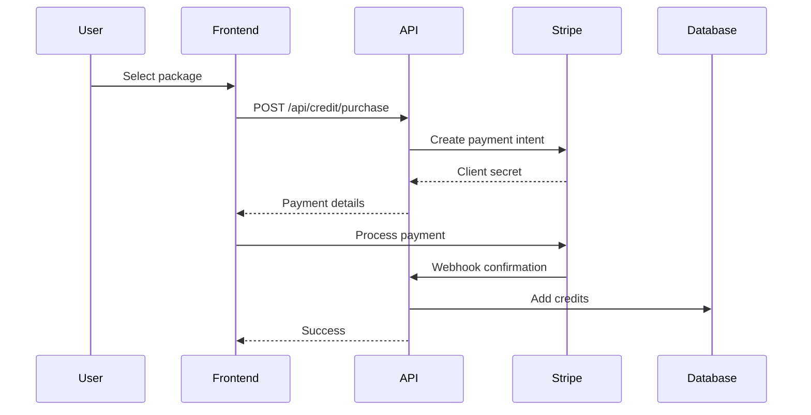

# Credit System & Payment Integration

## Overview

The AI Profile Photo Maker uses a unified credit balance for instant headshots, enhancements, and optional advanced generation/training flows. Weekly top-ups restore a user's balance to 5 when it drops below 5. The system integrates with Stripe for payment processing while maintaining a simulation mode for development.

## Credit System Architecture

### Credit Balance

1. **Unified Credits**
   - Single balance for all operations
   - Credits never expire and roll over

2. **Weekly Top-Up**
   - If credits are below 5 at reset, balance is topped up to 5
   - Reset runs weekly (midnight UTC)

### Credit Costs

```csharp
public static class CreditCosts
{
    public const int PhotoGeneration = 5;   // Per image
    public const int PhotoEnhancement = 1;  // Per image
    public const int ModelTraining = 15;    // Per training job
}
```

### Database Schema

#### UserProfile Credits
```sql
CREATE TABLE UserProfiles (
    -- Other fields...
    Credits INTEGER DEFAULT 5,
    LastCreditReset DATETIME
);
```

#### Credit Packages
```sql
CREATE TABLE CreditPackages (
    Id INTEGER PRIMARY KEY,
    Name TEXT NOT NULL,
    Credits INTEGER NOT NULL,
    Price DECIMAL(10,2) NOT NULL,
    IsActive BOOLEAN DEFAULT 1,
    CreatedAt DATETIME NOT NULL
);
```

## Credit Management

### Credit Calculation

```csharp
public class CreditService
{
    public int GetAvailableCredits(UserProfile user)
    {
        return user.Credits;
    }
    
    public async Task<bool> DeductCredits(string userId, int amount)
    {
        var user = await GetUser(userId);
        if (user.Credits < amount) return false;
        user.Credits -= amount;
        
        await SaveChanges();
        return true;
    }
}
```

### Weekly Reset System

```csharp
public class BasicTierBackgroundService : BackgroundService
{
    protected override async Task ExecuteAsync(CancellationToken stoppingToken)
    {
        while (!stoppingToken.IsCancellationRequested)
        {
            var now = DateTime.UtcNow;
            var nextMonday = GetNextMonday(now);
            var delay = nextMonday - now;
            
            await Task.Delay(delay, stoppingToken);
            await ResetWeeklyCredits();
        }
    }
    
    private async Task ResetWeeklyCredits()
    {
        await _dbContext.Database.ExecuteSqlRawAsync(@"
            UPDATE UserProfiles
            SET Credits = CASE WHEN Credits < 5 THEN 5 ELSE Credits END,
                LastCreditReset = @p0
            WHERE SubscriptionTier = 0",
            DateTime.UtcNow);
    }
}
```

## Payment Integration

### Stripe Configuration

#### Development Mode
```json
{
  "PaymentSimulation": {
    "Enabled": true,
    "SkipStripeIntegration": true
  },
  "Stripe": {
    "PublishableKey": "pk_test_...",
    "SecretKey": "sk_test_...",
    "WebhookSecret": "whsec_..."
  }
}
```

### Credit Package Purchase Flow



### Frontend Implementation

#### Credit Display Component
```typescript
@Component({
  selector: 'app-credit-status',
  template: `
    <div class="credit-display">
      <div class="credit-circle">
        <span class="credit-number">{{credits}}</span>
        <span class="credit-label">Credits</span>
      </div>
      <div class="credit-breakdown">
        <p>Weekly top-ups restore balance to 5 when below</p>
      </div>
      <button mat-button (click)="openPurchaseDialog()">
        Buy Credits
      </button>
    </div>
  `
})
```

#### Purchase Dialog
```typescript
interface CreditPackageOption {
  id: number;
  name: string;
  credits: number;
  price: number;
  popular?: boolean;
}

@Component({
  selector: 'app-credit-purchase',
  template: `
    <mat-dialog-content>
      <h2>Select Credit Package</h2>
      <div class="package-grid">
        <mat-card *ngFor="let package of packages" 
                  [class.popular]="package.popular"
                  (click)="selectPackage(package)">
          <mat-card-header>
            <mat-card-title>{{package.name}}</mat-card-title>
            <div class="popular-badge" *ngIf="package.popular">
              Most Popular
            </div>
          </mat-card-header>
          <mat-card-content>
            <div class="credits">{{package.credits}} Credits</div>
            <div class="price">${{package.price}}</div>
            <div class="per-credit">
              ${{(package.price / package.credits).toFixed(2)}} per credit
            </div>
          </mat-card-content>
        </mat-card>
      </div>
    </mat-dialog-content>
  `
})
```

### Stripe Integration

#### Payment Service
```typescript
export class StripeService {
  private stripe: Stripe;
  
  async initializePayment(packageId: number): Promise<PaymentIntent> {
    const response = await this.http.post('/api/credit/purchase', {
      packageId: packageId
    }).toPromise();
    
    const { clientSecret, amount } = response;
    
    const result = await this.stripe.confirmCardPayment(clientSecret, {
      payment_method: {
        card: this.cardElement,
        billing_details: {
          email: this.currentUser.email
        }
      }
    });
    
    if (result.error) {
      throw new Error(result.error.message);
    }
    
    return result.paymentIntent;
  }
}
```

#### Webhook Handler
```csharp
[HttpPost("stripe-webhook")]
public async Task<IActionResult> HandleStripeWebhook()
{
    var json = await new StreamReader(HttpContext.Request.Body).ReadToEndAsync();
    var stripeEvent = EventUtility.ConstructEvent(
        json,
        Request.Headers["Stripe-Signature"],
        _webhookSecret
    );
    
    switch (stripeEvent.Type)
    {
        case Events.PaymentIntentSucceeded:
            var paymentIntent = stripeEvent.Data.Object as PaymentIntent;
            await ProcessSuccessfulPayment(paymentIntent);
            break;
            
        case Events.PaymentIntentPaymentFailed:
            await HandleFailedPayment(stripeEvent.Data.Object);
            break;
    }
    
    return Ok();
}
```

#### Local Stripe CLI Workflow

1. **Configure API keys**  
   Use `dotnet user-secrets` to store your Stripe test keys so the API can create payment intents:

   ```bash
   dotnet user-secrets set "Stripe:SecretKey" "sk_test_..."
   dotnet user-secrets set "Stripe:PublishableKey" "pk_test_..."
   ```

2. **Start the dev stack**  
   Run `./dev-start.sh` (or start the API with `dotnet run` and the UI with `npm run dev:local`) so `http://localhost:5032` is available.

3. **Forward Stripe webhooks**  
   In a new terminal session run:

   ```bash
   stripe listen --forward-to http://localhost:5032/api/webhooks/stripe
   ```

   Copy the generated `whsec_...` secret and update your configuration:

   ```bash
   dotnet user-secrets set "Stripe:WebhookSecret" "whsec_..."
   ```

4. **Create a payment intent**  
   Use the Premium page purchase flow (or call `POST /api/credit/create-payment-intent`) to create an intent. The response includes a `paymentTransactionId` and the purchase metadata is stored automatically.

5. **Simulate the webhook (optional)**  
   To complete the purchase without entering test card details, trigger a Stripe event that references the same metadata:

   ```bash
   stripe trigger payment_intent.succeeded \
     --add payment_intent:metadata[user_id]=<AUTH_USER_ID> \
     --add payment_intent:metadata[package_id]=<PACKAGE_ID> \
     --add payment_intent:metadata[payment_transaction_id]=<TRANSACTION_ID>
   ```

   Replace the placeholders with values from the API response. A real confirmation through the UI also emits the webhook automatically.

6. **Verify credits**  
   Refresh the Premium page or call `GET /api/credit/status` to confirm that credits were applied.

> Tip: You can fetch the authenticated user id with `GET /api/auth/profile`; the `id` field matches the metadata required by the webhook.

- Keep the Stripe CLI session running while testing so events reach the API.
- Each time you restart `stripe listen`, update the webhook secret.

### Production Webhook Setup

Follow these steps when you’re ready to accept live payments:

1. **Create the endpoint in Stripe Dashboard**
   - Sign in at https://dashboard.stripe.com/ and switch to the *Live* data view.
   - Navigate to *Developers → Webhooks* and select **Add endpoint**.
   - Set the URL to your deployed API, e.g. `https://api.aiprofilephotomaker.com/api/webhooks/stripe`.
   - Subscribe to the events:
     - `payment_intent.succeeded`
     - `payment_intent.payment_failed`
     - `payment_intent.canceled`
   - Save and copy the displayed signing secret (`whsec_…`). Store it in your production secret store as `Stripe:WebhookSecret`.

2. **(Optional) Create via Stripe CLI**
   ```bash
   stripe webhook create \
     --url https://api.aiprofilephotomaker.com/api/webhooks/stripe \
     --api-key "$STRIPE_LIVE_SECRET_KEY" \
     --description "AI Profile Photo Maker Production" \
     --enabled-events payment_intent.succeeded \
     --enabled-events payment_intent.payment_failed \
     --enabled-events payment_intent.canceled
   ```
   Capture the signing secret from the output and store it alongside the live API keys.

3. **Configure live keys**
   - Store `Stripe:SecretKey`, `Stripe:PublishableKey`, and `Stripe:WebhookSecret` in your production configuration source (Azure App Service settings, Key Vault, etc.).
   - Verify that the API loads these values (see `StripeOptions`) before enabling the live UI flow.

4. **Smoke test**
   - Use Stripe’s “Send test event” button or a real card on the production site to confirm credits post end-to-end.

> Never commit live keys to source control. Manage them exclusively through your deployment environment.

## Usage Tracking

### Usage Logs
```csharp
public class UsageLog
{
    public int Id { get; set; }
    public string UserId { get; set; }
    public string Action { get; set; }  // "Generate", "Enhance"
    public int CreditsUsed { get; set; }
    public DateTime Timestamp { get; set; }
    public string? Details { get; set; }  // JSON metadata
}
```

### Analytics Dashboard
```typescript
interface UsageStats {
  totalCreditsUsed: number;
  creditsByAction: {
    generation: number;
    enhancement: number;
  };
  weeklyTrend: Array<{
    week: Date;
    credits: number;
  }>;
  averagePerUser: number;
}
```

## Credit Package Management

### Default Packages
```sql
INSERT INTO CreditPackages (Name, Credits, Price, IsActive) VALUES
('Starter Pack', 50, 4.99, 1),
('Popular Pack', 200, 14.99, 1),  -- Best value
('Pro Pack', 500, 29.99, 1),
('Enterprise', 2000, 99.99, 1);
```

### Admin Interface
```csharp
[Authorize(Roles = "Admin")]
[HttpPost("packages")]
public async Task<IActionResult> CreatePackage(CreditPackageDto package)
{
    var newPackage = new CreditPackage
    {
        Name = package.Name,
        Credits = package.Credits,
        Price = package.Price,
        IsActive = true,
        CreatedAt = DateTime.UtcNow
    };
    
    await _context.CreditPackages.AddAsync(newPackage);
    await _context.SaveChangesAsync();
    
    return Ok(newPackage);
}
```

## Simulation Mode

### Development Testing
```typescript
// In development/simulation mode
if (environment.features.paymentSimulation) {
  // Skip Stripe, directly add credits
  this.http.post('/api/credit/simulate-purchase', {
    packageId: selectedPackage.id
  }).subscribe(result => {
    this.notificationService.success('Credits added!');
    this.refreshCredits();
  });
}
```

### Test Scenarios
1. **Insufficient Credits**
   - Try to generate with 0 credits
   - Verify error handling

2. **Weekly Top-Up**
   - Advance time to Monday
   - Verify credits top up to 5 when below

3. **Purchase Flow**
   - Complete purchase
   - Verify credits added immediately

## Best Practices

1. **Transaction Safety**
   - Use database transactions for credit operations
   - Log all credit changes for audit
   - Implement idempotency for webhooks

2. **User Experience**
   - Show credit cost before actions
   - Provide clear purchase options
   - Display credit history

3. **Security**
   - Validate all credit operations server-side
   - Use Stripe webhook signatures
   - Implement rate limiting

## Troubleshooting

### Common Issues

1. **Credits Not Updating**
   - Check webhook configuration
   - Verify payment completion
   - Review transaction logs

2. **Weekly Reset Fails**
   - Check background service status
   - Verify timezone handling
   - Review database constraints

3. **Payment Failures**
   - Check Stripe configuration
   - Verify API keys
   - Test webhook endpoint

## API Reference

See [API Reference](./API_REFERENCE.md#credits) for detailed endpoint documentation.
