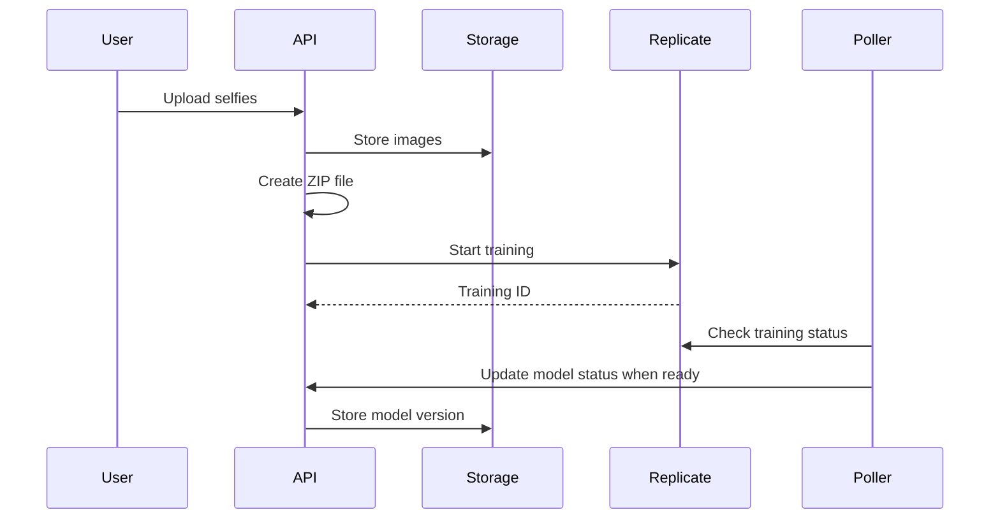

# Photo Processing & AI Generation

## Overview

The AI Profile Photo Maker uses advanced AI models from Replicate to train custom models on user selfies and generate professional profile photos in various styles. The system includes photo enhancement capabilities and intelligent face detection for optimal results.

## Core Features

### Photo Upload & Validation

1. **Upload Limits**
   - Maximum 20 selfies per user (configurable)
   - Supported formats: JPG, JPEG, PNG, WebP
   - File size limit: 10MB per image
   - Minimum dimensions: 512x512 pixels

2. **Face Detection**
   - Uses face-api.js for client-side validation
   - Ensures faces are detected before upload
   - Provides real-time feedback during upload
   - Filters out non-face images automatically

3. **Image Quality Validation**
   - Resolution checks for training requirements
   - Aspect ratio recommendations
   - Image clarity assessment
   - Duplicate detection

### AI Model Training

#### Training Process Flow



#### Training Configuration

- **Model**: Fast FLUX Trainer (`replicate/fast-flux-trainer`)
- **Training Time**: ~30 minutes
- **Input Requirements**: 10-20 high-quality selfies
- **Output**: Custom LoRA model for user

#### Webhook Integration

Training completion uses background polling. Webhooks are used for prediction completion (generated images).

```csharp
[HttpPost("prediction-complete")]
[ReplicateSignatureValidation]
public async Task<IActionResult> HandleReplicateWebhook(
    [FromBody] JsonDocument body)
{
    // Validate webhook signature
    // Persist generated images
    // Update retention metadata
}
```

### Image Generation

#### Style-Based Generation

The system supports 23+ professional photo styles:

- **Professional**: LinkedIn, Corporate, Executive, Consultant
- **Creative**: Artistic, Author, Influencer, Creative
- **Industry**: Medical, Legal, Tech Professional, Academic
- **Lifestyle**: Casual, Fitness, Digital Nomad, Spiritual
- **Business**: Entrepreneur, Startup, Business Consultant

#### Generation Parameters

```json
{
  "model": "black-forest-labs/flux-dev",
  "lora": "user-trained-model-url",
  "prompt": "Professional headshot of {trigger_word}, [style-specific details]",
  "negative_prompt": "[style-specific exclusions]",
  "num_outputs": 2,
  "aspect_ratio": "1:1",
  "guidance_scale": 3.5,
  "num_inference_steps": 28
}
```

### Photo Enhancement

#### Enhancement Features

1. **AI-Powered Enhancement**
   - Standard enhancements use Replicate FLUX Kontext Pro
   - Stylized enhancements use OpenAI gpt-image-1 (select styles)
   - Improves lighting and clarity while maintaining natural appearance
   - UI routes to the correct provider based on `enhancementType`

2. **Credit System**
   - Weekly credits available (Basic tier)
   - Replicate enhancements cost 1 credit
   - OpenAI styles cost 2 credits

3. **Enhancement Process**

```typescript
const openAIStyles = ['chibi', 'pixar_3d', 'studio_ghibli'];
const isOpenAI = openAIStyles.includes(enhancementType);
const endpoint = isOpenAI ? '/api/enhancement/enhance' : '/api/replicate/enhance';

const result = await http.post(endpoint, {
  imageUrl,
  enhancementType,
  turnstileToken
});
```

## Technical Implementation

### Backend Architecture

#### Key Services

1. **ReplicateApiClient**
   - Manages Replicate API communication
   - Handles training and generation requests
   - Implements retry logic and error handling

2. **ImageProcessingService** 
   - Image validation and preprocessing
   - ZIP file creation for training
   - Generated image storage

3. **ModelCreationPollingService**
   - Background service for status updates
   - Polls Replicate for training completion
   - Updates database with model status

### Frontend Components

#### File Upload Component

```typescript
@Component({
  selector: 'app-file-upload',
  template: `
    <div class="upload-area" (drop)="onDrop($event)">
      <input type="file" 
             multiple 
             accept="image/*"
             (change)="onFileSelect($event)">
      <div class="preview-grid">
        
      </div>
    </div>
  `
})
```

#### Face Detection Service

```typescript
async detectFaces(imageFile: File): Promise<FaceDetectionResult> {
  const img = await this.loadImage(imageFile);
  const detections = await faceapi
    .detectAllFaces(img)
    .withFaceLandmarks();
  
  return {
    hasFaces: detections.length > 0,
    faceCount: detections.length,
    confidence: detections[0]?.detection.score || 0
  };
}
```

### Database Schema

#### ProcessedImage Table

```sql
CREATE TABLE ProcessedImages (
    Id INTEGER PRIMARY KEY,
    UserId TEXT NOT NULL,
    ImageUrl TEXT UNIQUE NOT NULL,
    StyleName TEXT NOT NULL,
    GeneratedAt DATETIME NOT NULL,
    ImageType INTEGER NOT NULL,
    IsDeleted BOOLEAN DEFAULT 0,
    DeletedAt DATETIME NULL,
    FOREIGN KEY (UserId) REFERENCES AspNetUsers(Id)
);
```

## Hybrid Filesystem-Database Architecture

### Problem Solved

The system implements a hybrid approach to handle cases where webhooks fail or database records are missing while files exist on the filesystem.

### Self-Healing Mechanism

1. **Auto-Detection**
   - Dashboard checks for filesystem/database mismatches
   - Automatically repairs missing records
   - Preserves existing data integrity

2. **Reconciliation API**

```csharp
[HttpPost("reconcile-images")]
public async Task<IActionResult> ReconcileImages()
{
    var filesystemImages = GetFilesystemImages();
    var databaseImages = GetDatabaseImages();
    
    var missingInDb = filesystemImages.Except(databaseImages);
    
    foreach (var image in missingInDb)
    {
        await CreateDatabaseRecord(image);
    }
    
    return Ok(new { repaired = missingInDb.Count() });
}
```

## Image Storage

### Directory Structure

```
/uploads/{userId}/
  - {imageId}_selfie.jpg    # Original uploads
  
/training-zips/{userId}.zip  # Training data

/generated/{userId}/
  - {style}_{timestamp}_{hash}.png  # Generated images
  
/enhanced/{userId}/
  - {imageId}_enhanced.jpg   # Enhanced photos
```

### Cleanup & Retention

- Automatic cleanup after 30 days (configurable)
- Background service runs daily
- Preserves database records with soft delete
- Removes physical files to save storage

## Performance Optimization

### Caching Strategy

1. **Generated Images Cache**
   - 5-minute cache for dashboard stats
   - Reduces database queries by 50%
   - Invalidated on new generation

2. **Model Status Cache**
   - Caches training status for 30 seconds
   - Prevents excessive Replicate API calls
   - Updates via webhook

### Batch Operations

```typescript
// Batch face detection
const detectionPromises = files.map(file => 
  this.faceDetectionService.detectFaces(file)
);

const results = await Promise.all(detectionPromises);
```

## Best Practices

1. **Image Quality**
   - Recommend well-lit, clear selfies
   - Variety of angles and expressions
   - Consistent person across images

2. **Generation Timing**
   - Generate during off-peak hours
   - Queue management for multiple users
   - Progress indication for long operations

3. **Error Handling**
   - Graceful degradation on API failures
   - User-friendly error messages
   - Automatic retry for transient errors

## Troubleshooting

### Common Issues

1. **Training Fails**
   - Check image quality and count
   - Verify ZIP file creation
   - Review Replicate API limits

2. **Missing Generated Images**
   - Run reconciliation endpoint
   - Check webhook logs
   - Verify filesystem permissions

3. **Slow Generation**
   - Monitor Replicate queue status
   - Check API rate limits
   - Consider upgrading Replicate plan

## API Reference

See [API Reference](./API_REFERENCE.md#image-processing) for detailed endpoint documentation.
