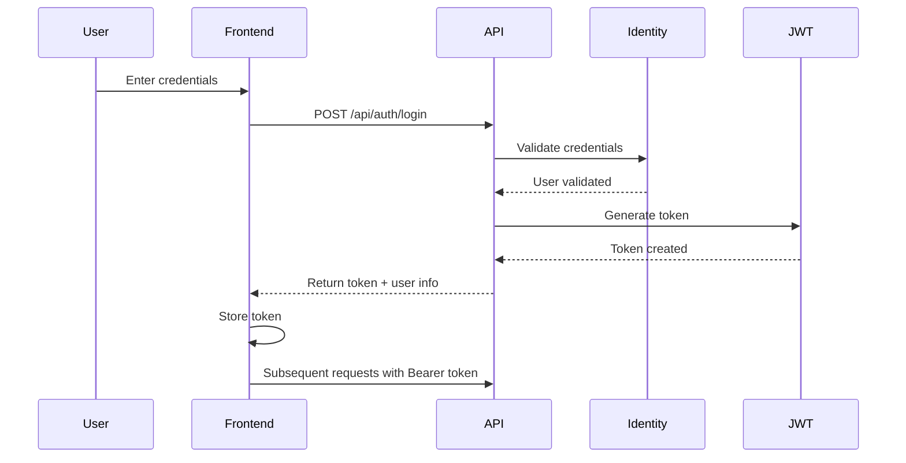

# Authentication System

## Overview

The AI Profile Photo Maker authentication system provides secure user authentication through both traditional email/password registration and OAuth integration with major providers. The system uses JWT tokens for stateless authentication and ASP.NET Core Identity for user management.

## Features

### Registration Methods

1. **Email/Password Registration**
   - Standard email and password registration
   - Password strength validation
   - Email verification (optional)
   - Automatic user profile creation

2. **OAuth Providers**
   - Google Sign-In
   - Facebook Login
   - Apple Sign-In
   - Automatic account linking for existing emails

### Authentication Flow



### Security Features

- **JWT Token Authentication**
  - Configurable expiration (default: 7 days)
  - Secure token storage in localStorage
  - Automatic token refresh

- **Password Security**
  - Minimum 6 characters
  - Requires uppercase, lowercase, digit, and special character
  - Hashed using ASP.NET Core Identity defaults

- **CORS Configuration**
  - Configured for local development and ngrok tunnels
  - Production-ready CORS policies

## Implementation Details

### Backend Components

#### AuthController (`/api/auth`)
- `POST /register` - New user registration
- `POST /login` - User authentication
- `POST /external-login` - OAuth login
- `GET /user-info` - Get current user details

#### AuthService
- User registration logic
- JWT token generation
- OAuth provider integration
- User profile initialization

#### Configuration
```json
{
  "JWT": {
    "ValidAudience": "https://your-domain.com",
    "ValidIssuer": "https://your-domain.com",
    "Secret": "YOUR_JWT_SECRET_KEY"
  }
}
```

### Frontend Components

#### AuthService (Angular)
- Token management
- Login/logout methods
- User state management
- HTTP interceptor for auth headers

#### Auth Guards
- `AuthGuard` - Protects authenticated routes
- `GuestGuard` - Redirects authenticated users

#### Login Component
```typescript
// Email/password login
await this.authService.login(email, password);

// OAuth login
await this.authService.socialLogin(provider);
```

## OAuth Integration

### Google Sign-In
1. Configure in Google Cloud Console
2. Add client ID to environment config
3. Initialize in Angular app config

### Facebook Login
1. Create Facebook App
2. Configure OAuth redirect URIs
3. Add app ID to configuration

### Apple Sign-In
1. Configure in Apple Developer Portal
2. Generate service ID and keys
3. Configure redirect URLs

## Token Management

### Storage
- Tokens stored in localStorage
- Automatic cleanup on logout
- Cross-tab synchronization

### Renewal
- Check token expiration before API calls
- Automatic refresh when needed
- Graceful degradation on failure

## Error Handling

### Common Error Codes
- `401` - Unauthorized (invalid/expired token)
- `403` - Forbidden (insufficient permissions)
- `409` - Conflict (email already registered)

### Client-Side Handling
```typescript
this.authService.login(email, password).subscribe({
  next: (response) => {
    // Success - navigate to Photo Workspace
  },
  error: (error) => {
    if (error.status === 401) {
      // Invalid credentials
    } else if (error.status === 409) {
      // Email already exists
    }
  }
});
```

## Best Practices

1. **Security**
   - Always use HTTPS in production
   - Store sensitive config in user secrets
   - Implement rate limiting for auth endpoints

2. **User Experience**
   - Show loading states during authentication
   - Provide clear error messages
   - Remember user preference (remember me)

3. **Development**
   - Use different JWT secrets per environment
   - Test OAuth flows with ngrok for callbacks
   - Monitor failed login attempts

## Troubleshooting

### Common Issues

1. **CORS Errors**
   - Check API CORS configuration
   - Verify allowed origins include frontend URL
   - Ensure credentials are included in requests

2. **OAuth Redirect Issues**
   - Verify redirect URIs match exactly
   - Check ngrok configuration for development
   - Ensure OAuth app is not in sandbox mode

3. **Token Expiration**
   - Check token expiration time in config
   - Verify client properly handles 401 responses
   - Implement token refresh mechanism

## API Reference

See [API Reference](./API_REFERENCE.md#authentication) for detailed endpoint documentation.